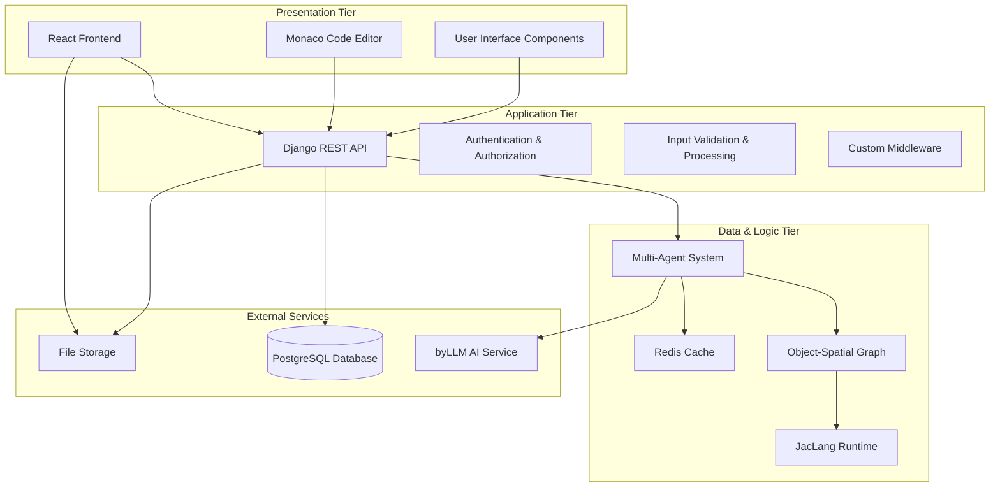
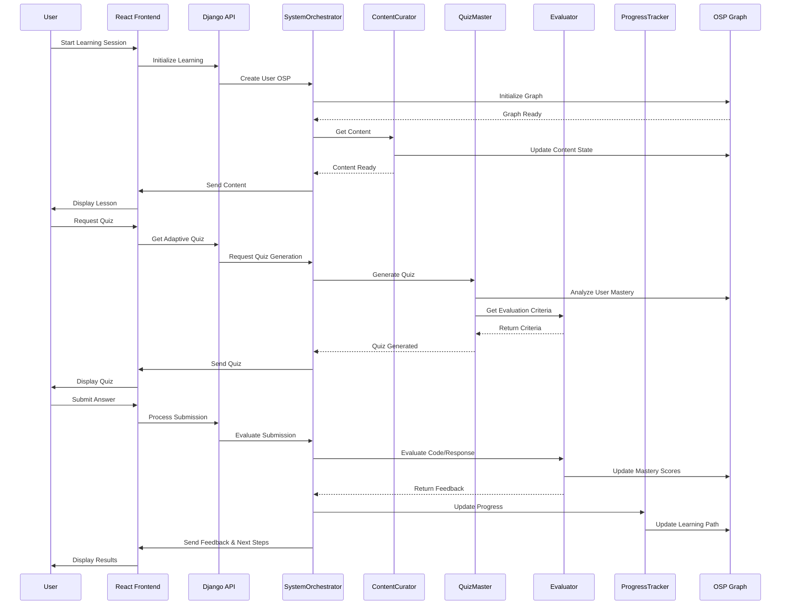
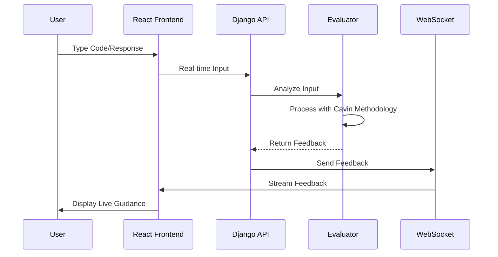

# Architecture Overview

**Author**: Cavin Otieno  
**Version**: 1.0.0  
**Last Updated**: 2025-12-02 04:26:27  

## 🏗️ System Architecture

The Jeseci Interactive Learning Platform implements a modern 3-Tier enterprise architecture designed for scalability, maintainability, and adaptive learning capabilities.

### 📐 Architecture Layers



## 🎯 Core Architecture Principles

### 1. Microservices Design
- **Separation of Concerns**: Each component has a specific responsibility
- **Scalability**: Components can scale independently
- **Maintainability**: Clear boundaries between services

### 2. Event-Driven Architecture
- **Asynchronous Processing**: Non-blocking operations for optimal performance
- **Real-time Updates**: Live feedback and progress tracking
- **Scalable Communication**: Efficient inter-component messaging

### 3. Agent-Based Intelligence
- **Distributed Decision Making**: Six specialized agents for different learning aspects
- **Cooperative Learning**: Agents work together to provide comprehensive feedback
- **Adaptive Behavior**: Agents adjust based on user progress and preferences

## 🏢 Tier Descriptions

### Presentation Tier (Frontend)
**Technology**: React 18+ with TypeScript

**Components**:
- **User Interface**: Modern, responsive design with TailwindCSS
- **Code Editor**: Monaco Editor for interactive programming exercises
- **Real-time Updates**: WebSocket connections for live feedback
- **State Management**: Zustand for efficient state handling

**Features**:
- Interactive learning environments
- Real-time code compilation and execution
- Progress visualization and analytics
- Gamification elements

### Application Tier (Backend)
**Technology**: Django 4.2+ with Django REST Framework

**Components**:
- **API Gateway**: RESTful API endpoints for frontend communication
- **Authentication**: JWT-based authentication with role-based access
- **Business Logic**: Core learning platform functionality
- **Security**: Input validation, CSRF protection, rate limiting

**Features**:
- User management and profiles
- Learning progress tracking
- Assessment processing
- Content management

### Data & Logic Tier (Multi-Agent System)
**Technology**: Jac Programming Language with Object-Spatial Graph

**Agents**:
1. **SystemOrchestrator**: Coordinates all system activities
2. **ContentCurator**: Manages and curates learning materials
3. **QuizMaster**: Generates adaptive assessments
4. **Evaluator**: Provides intelligent evaluation and feedback
5. **ProgressTracker**: Monitors and analyzes learning patterns
6. **Motivator**: Handles gamification and motivation

**Key Technologies**:
- **Object-Spatial Graph (OSP)**: Represents user knowledge and relationships
- **JacLang Runtime**: Executes agent logic and interactions
- **byLLM Integration**: AI-powered assessment and feedback

## 🔄 Data Flow Architecture

### Learning Session Flow


### Real-time Feedback Flow


## 🗄️ Data Architecture

### Database Design
```sql
-- Core user and learning data
CREATE TABLE users (
    id SERIAL PRIMARY KEY,
    username VARCHAR(50) UNIQUE NOT NULL,
    email VARCHAR(100) UNIQUE NOT NULL,
    profile_data JSONB,
    created_at TIMESTAMP DEFAULT NOW()
);

CREATE TABLE learning_sessions (
    id SERIAL PRIMARY KEY,
    user_id INTEGER REFERENCES users(id),
    session_data JSONB,
    status VARCHAR(20),
    created_at TIMESTAMP DEFAULT NOW()
);

CREATE TABLE assessments (
    id SERIAL PRIMARY KEY,
    session_id INTEGER REFERENCES learning_sessions(id),
    quiz_data JSONB,
    user_submission JSONB,
    evaluation_results JSONB,
    created_at TIMESTAMP DEFAULT NOW()
);

-- OSP Graph data
CREATE TABLE nodes (
    id SERIAL PRIMARY KEY,
    user_id INTEGER REFERENCES users(id),
    node_type VARCHAR(50),
    node_data JSONB,
    mastery_score FLOAT
);

CREATE TABLE edges (
    id SERIAL PRIMARY KEY,
    source_node_id INTEGER REFERENCES nodes(id),
    target_node_id INTEGER REFERENCES nodes(id),
    edge_type VARCHAR(50),
    weight FLOAT
);
```

### Redis Cache Strategy
- **Session Data**: Temporary learning session information
- **User Progress**: Real-time progress tracking
- **Agent States**: Multi-agent system state management
- **Rate Limiting**: API request throttling

## 🔐 Security Architecture

### Authentication & Authorization
- **JWT Tokens**: Secure, stateless authentication
- **Role-Based Access**: Different permission levels for users
- **API Security**: Rate limiting and input validation

### Data Protection
- **Encryption**: Data encryption at rest and in transit
- **Input Sanitization**: Protection against XSS and injection attacks
- **Audit Logging**: Comprehensive activity logging

## 🚀 Scalability Architecture

### Horizontal Scaling
- **Load Balancing**: Multiple application server instances
- **Database Sharding**: Partition user data across databases
- **Caching**: Redis cluster for distributed caching

### Performance Optimization
- **CDN**: Static asset delivery optimization
- **Database Indexing**: Optimized query performance
- **Asynchronous Processing**: Non-blocking background tasks

## 🔧 Development Architecture

### Development Workflow
```bash
# 1. Environment Setup (Latest Versions)
make init

# 2. Development (Latest Dependencies)
pip install jaclang django
npm install react typescript

# 3. Testing (Validate Functionality)
make test

# 4. Production (Lock Versions)
make freeze
make deploy
```

### Code Organization
```
/
├── frontend/                 # React TypeScript application
│   ├── src/
│   │   ├── components/      # Reusable UI components
│   │   ├── pages/          # Application pages
│   │   ├── hooks/          # Custom React hooks
│   │   └── types/          # TypeScript definitions
├── backend/                 # Django Python application
│   ├── api/                # REST API endpoints
│   ├── jac_layer/          # Multi-agent system
│   │   ├── walkers/        # Agent implementations
│   │   └── graph_manager.py # OSP graph management
├── docs/                   # Documentation
├── scripts/                # Utility scripts
└── deployment/             # Production deployment
```

## 📊 Monitoring & Observability

### Health Monitoring
- **API Health Checks**: Endpoint availability monitoring
- **Agent Status**: Multi-agent system health monitoring
- **Database Performance**: Query performance and connection health

### Metrics Collection
- **User Analytics**: Learning progress and engagement metrics
- **System Performance**: Response times and resource usage
- **Agent Performance**: Individual agent effectiveness metrics

## 🎯 Success Metrics

### Learning Effectiveness
- **Completion Rates**: User course completion statistics
- **Knowledge Retention**: Long-term learning outcome tracking
- **Engagement Metrics**: Time spent and interaction quality

### System Performance
- **Response Times**: API and user interface responsiveness
- **Uptime**: System availability and reliability
- **Scalability**: Performance under increased load

## 🔮 Future Architecture Considerations

### Planned Enhancements
- **Mobile Application**: React Native companion app
- **Advanced AI**: Enhanced byLLM integration and personalization
- **Blockchain**: Credential verification and achievement tracking
- **IoT Integration**: Wearable device learning analytics

---

**Next Steps**: Review [Multi-Agent System](multi_agent_system.md) for detailed agent interactions and [Component Diagram](component_diagram.md) for system decomposition.