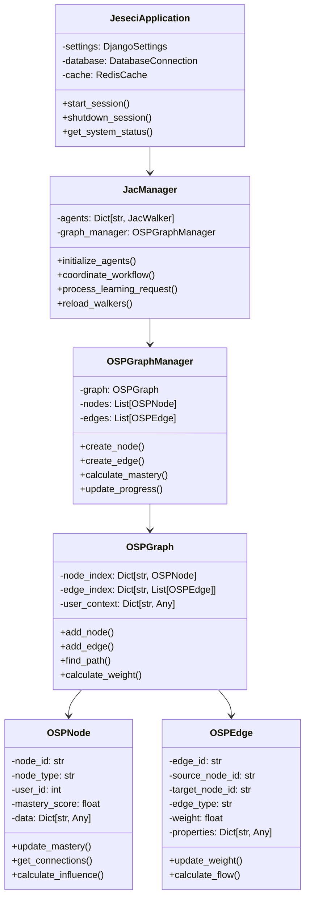
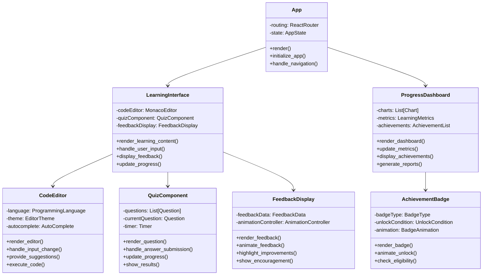
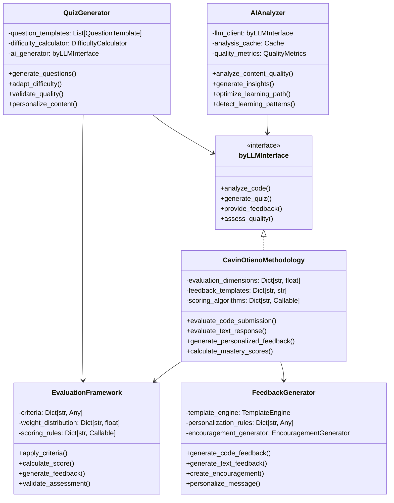
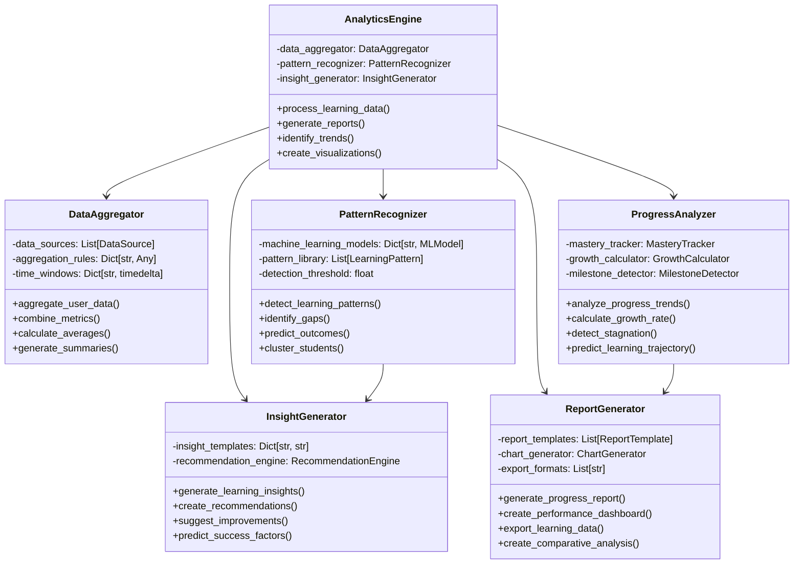
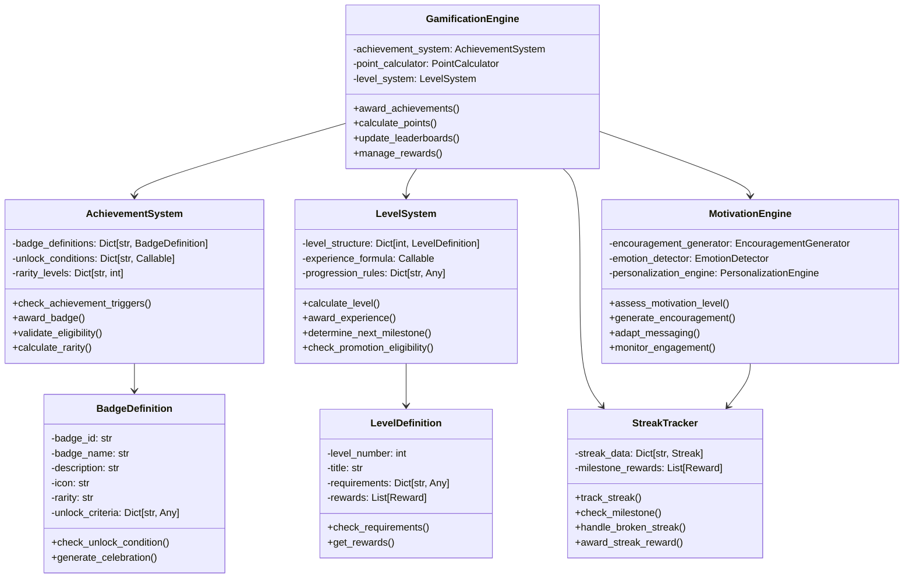
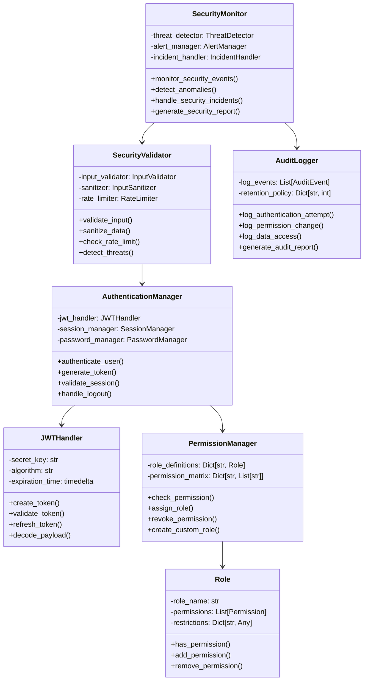
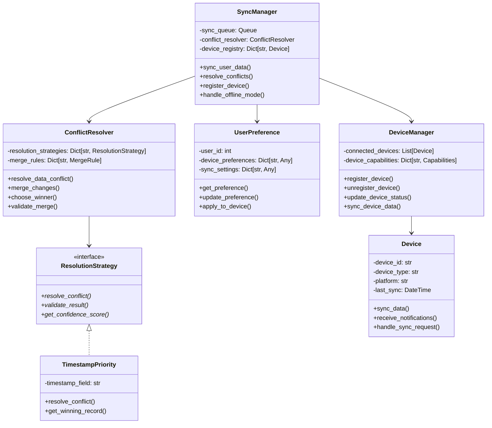
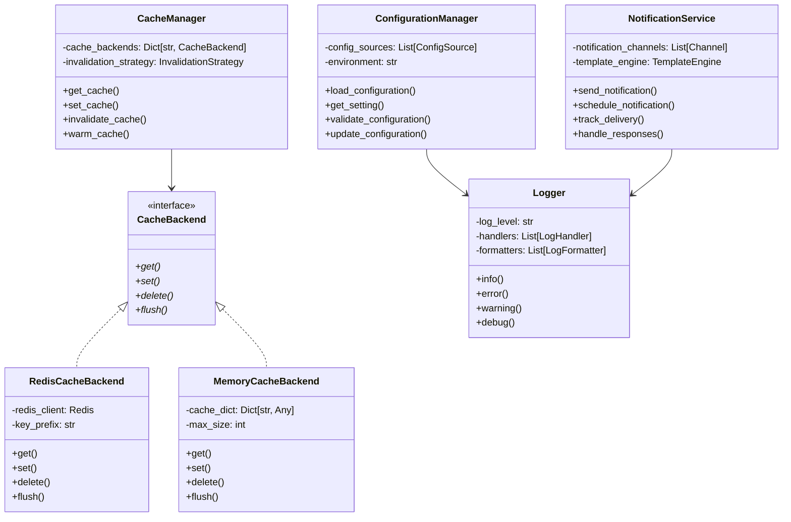

# Class Diagram

**Author**: Cavin Otieno  
**Version**: 1.0.0  
**Last Updated**: 2025-12-02 04:26:27  

## 🏗️ Object-Oriented Design

This document outlines the class structure and relationships in the Jeseci Interactive Learning Platform, showing the object-oriented design and architecture patterns used throughout the system.

## 🎯 Core System Classes

### Main Application Classes


## 🤖 Multi-Agent System Classes

### Agent Base Classes and Implementations

```mermaid
classDiagram
    class JacWalker {
        <<abstract>>
        -agent_name: str
        -capabilities: List[str]
        -state: Dict[str, Any]
        +execute()*
        +communicate()*
        +update_state()*
    }
    
    class SystemOrchestrator {
        -workflow_queue: Queue
        -agent_registry: Dict[str, JacWalker]
        -coordination_log: List[str]
        +initialize_learning_session()
        +coordinate_agent_workflow()
        +manage_system_state()
        +handle_error_recovery()
    }
    
    class ContentCurator {
        -content_library: ContentLibrary
        -quality_analyzer: AIAnalyzer
        -personalization_engine: PersonalizationEngine
        +curate_learning_content()
        +assess_content_quality()
        +adapt_content_difficulty()
        +update_content_versions()
    }
    
    class QuizMaster {
        -question_bank: QuestionBank
        -difficulty_adjuster: DifficultyAdjuster
        -ai_generator: AIGenerator
        +generate_adaptive_quiz()
        +adapt_question_difficulty()
        +validate_assessment_quality()
        +update_question_bank()
    }
    
    class Evaluator {
        -evaluation_frameworks: Dict[str, EvaluationFramework]
        -cavin_methodology: CavinOtienoMethodology
        -feedback_generator: FeedbackGenerator
        +evaluate_code_submission()
        +evaluate_text_response()
        +provide_real_time_feedback()
        +calculate_comprehensive_score()
    }
    
    class ProgressTracker {
        -analytics_engine: AnalyticsEngine
        -pattern_recognizer: PatternRecognizer
        -insight_generator: InsightGenerator
        +track_learning_progress()
        +generate_analytics_report()
        +identify_learning_gaps()
        +create_learning_recommendations()
    }
    
    class Motivator {
        -gamification_engine: GamificationEngine
        -achievement_system: AchievementSystem
        -encouragement_generator: EncouragementGenerator
        +provide_motivation()
        +manage_achievements()
        +assess_engagement_level()
        +generate_encouragement_messages()
    }
    
    JacWalker <|-- SystemOrchestrator
    JacWalker <|-- ContentCurator
    JacWalker <|-- QuizMaster
    JacWalker <|-- Evaluator
    JacWalker <|-- ProgressTracker
    JacWalker <|-- Motivator
```


## 🎨 Frontend React Classes

### React Component Architecture


## 🔧 Backend Django Classes

### Django Model and Service Architecture
```mermaid
classDiagram
    class User {
        -id: int
        -username: str
        -email: str
        -profile_data: JSONField
        -learning_preferences: Dict[str, Any]
        +create_learning_session()
        +update_progress()
        +get_learning_metrics()
    }
    
    class LearningSession {
        -id: int
        -user: User
        -session_data: JSONField
        -status: str
        -created_at: DateTime
        +initialize_session()
        +update_session_data()
        +complete_session()
    }
    
    class Assessment {
        -id: int
        -session: LearningSession
        -quiz_data: JSONField
        -user_submission: JSONField
        -evaluation_results: JSONField
        -created_at: DateTime
        +evaluate_submission()
        +generate_feedback()
        +update_mastery_scores()
    }
    
    class Content {
        -id: int
        -title: str
        -content_type: str
        -difficulty_level: str
        -content_data: JSONField
        -metadata: Dict[str, Any]
        +get_content()
        +adapt_difficulty()
        +validate_quality()
    }
    
    class ProgressRecord {
        -id: int
        -user: User
        -skill_area: str
        -mastery_score: float
        -learning_activity: str
        -timestamp: DateTime
        +update_score()
        +get_progress_history()
        +calculate_growth_rate()
    }
    
    class APIView {
        <<abstract>>
        -permission_classes: List[Permission]
        -authentication_classes: List[Authentication]
        +get_serializer_class()*
        +check_permissions()*
        +check_object_permissions()*
    }
    
    class LearningAPIView {
        -service_layer: LearningService
        -cache_manager: CacheManager
        +get_learning_content()
        +process_assessment()
        +update_progress()
        +get_learning_metrics()
    }
    
    User ||--o{ LearningSession : creates
    LearningSession ||--o{ Assessment : contains
    User ||--o{ ProgressRecord : has
    Content ||--o{ LearningSession : provides
    
    APIView <|-- LearningAPIView
    LearningAPIView --> User
    LearningAPIView --> LearningSession
    LearningAPIView --> Assessment
```

## 🧠 AI and Evaluation Classes

### AI Integration and Evaluation Framework


## 📊 Analytics and Reporting Classes

### Data Analysis and Reporting System


## 🎮 Gamification and Motivation Classes

### Achievement and Engagement System


## 🔐 Security and Authentication Classes

### Authentication and Security Framework


## 📱 Cross-Platform Synchronization Classes

### Multi-Device Learning Continuity


## 🔧 Utility and Helper Classes

### Supporting Classes and Services


## 📈 Design Patterns Used

### Architecture Patterns
- **Model-View-Controller (MVC)**: Frontend React components
- **Factory Pattern**: Agent creation and initialization
- **Observer Pattern**: Event handling and notifications
- **Strategy Pattern**: Conflict resolution and evaluation frameworks
- **Decorator Pattern**: Feature enhancement and caching
- **Facade Pattern**: Complex system interface simplification
- **Command Pattern**: Action execution and undo functionality

### Design Principles
- **Single Responsibility**: Each class has one clear purpose
- **Open/Closed**: Extensible through interfaces and inheritance
- **Liskov Substitution**: Subclasses can replace base classes
- **Interface Segregation**: Focused, specific interfaces
- **Dependency Inversion**: Depend on abstractions, not concretions

---

**Next Steps**: Review [Deployment Architecture](deployment_architecture.md) for infrastructure planning and [API Reference](api_reference.yaml) for endpoint documentation.