# Component Diagram

**Author**: Cavin Otieno  
**Version**: 1.0.0  
**Last Updated**: 2025-12-02 04:26:27  

## 🏗️ System Component Architecture

The Jeseci Interactive Learning Platform follows a modular component architecture designed for scalability, maintainability, and enterprise-grade reliability.

### 📐 High-Level Component Overview

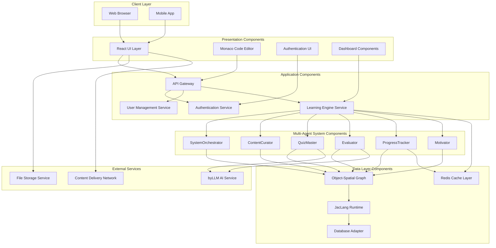

## 🎯 Frontend Component Architecture

### React Component Hierarchy
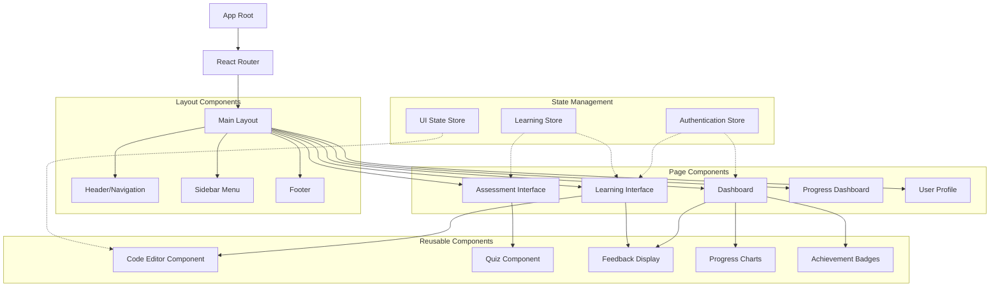

### Component Dependencies
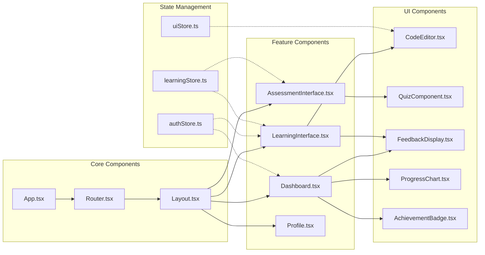

## 🏢 Backend Component Architecture

### Django Application Structure
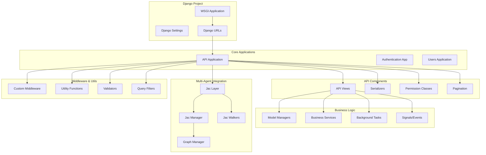

### API Component Design
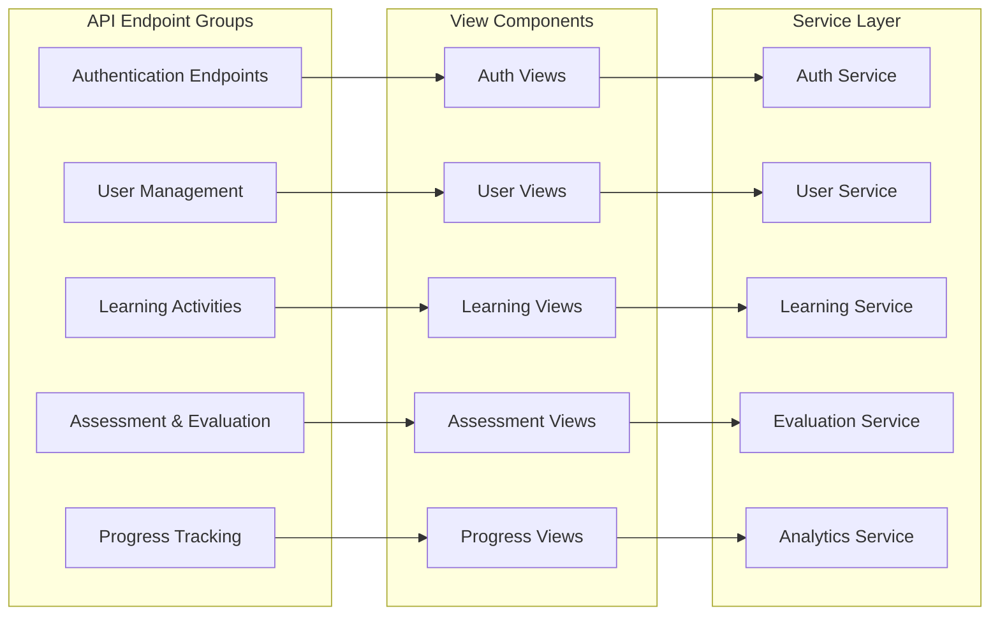

## 🔄 Multi-Agent System Components

### Agent Component Structure
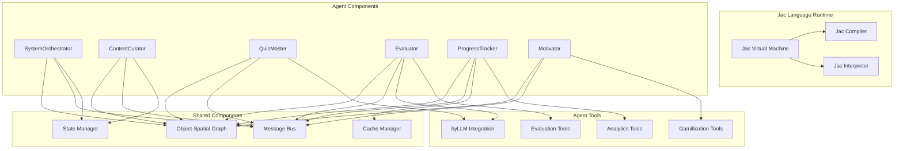

## 🗄️ Data Layer Components

### Database Architecture
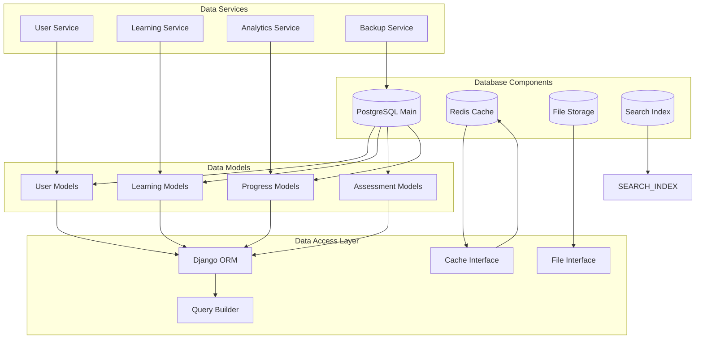

### Object-Spatial Graph Components
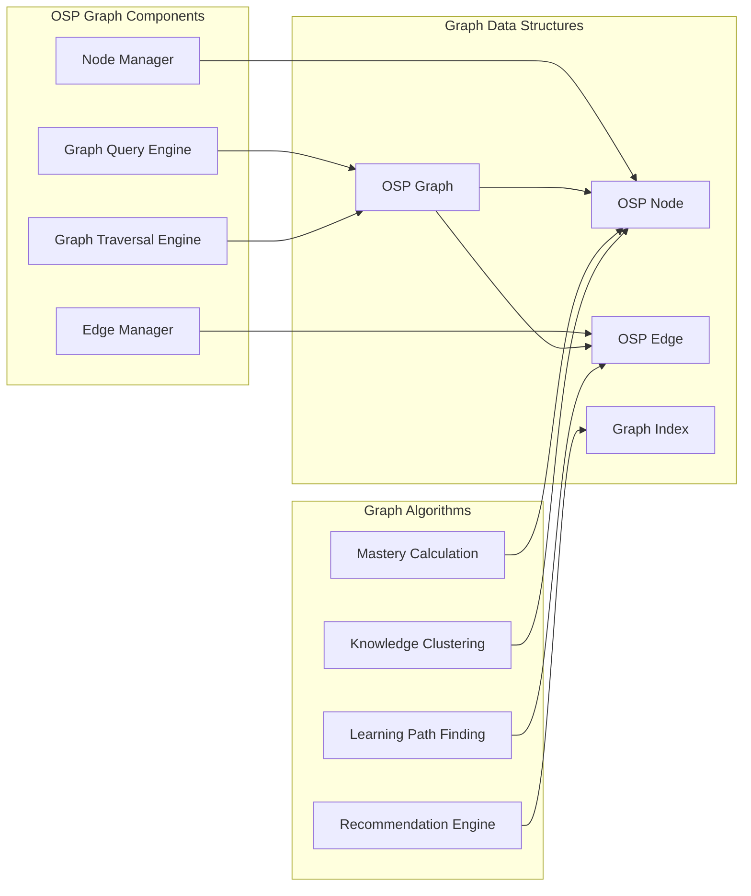

## 🔌 Integration Components

### External Service Integration
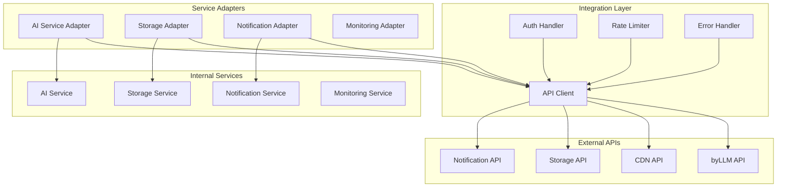

### WebSocket Components
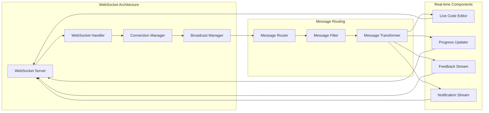

## 🔧 Configuration & Deployment Components

### Configuration Management
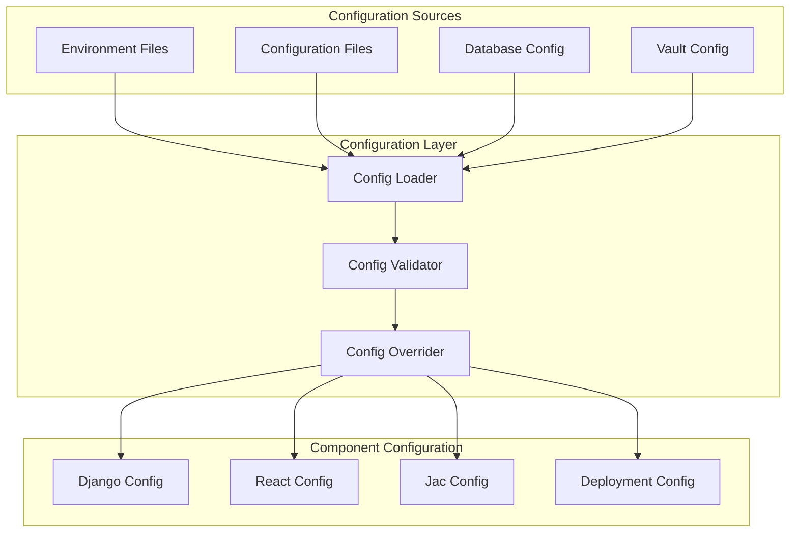

### Deployment Architecture
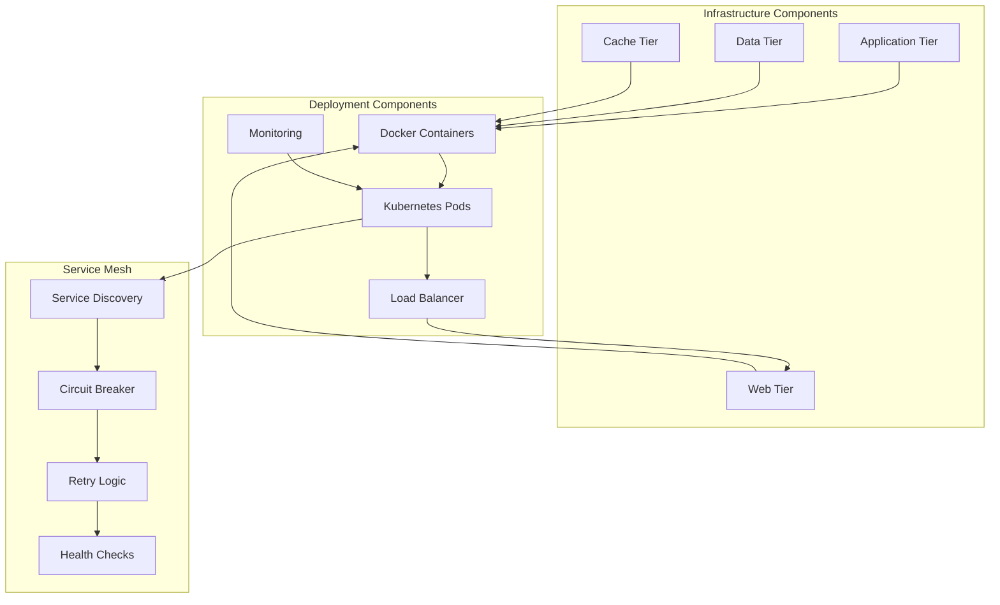

## 📊 Component Metrics & Monitoring

### Performance Monitoring
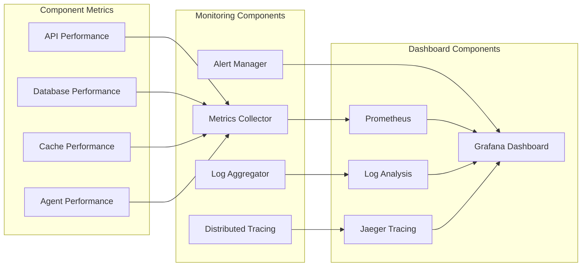

---

**Next Steps**: Review [Sequence Diagram](sequence_diagram.md) for detailed process flows and [Deployment Architecture](deployment_architecture.md) for infrastructure planning.