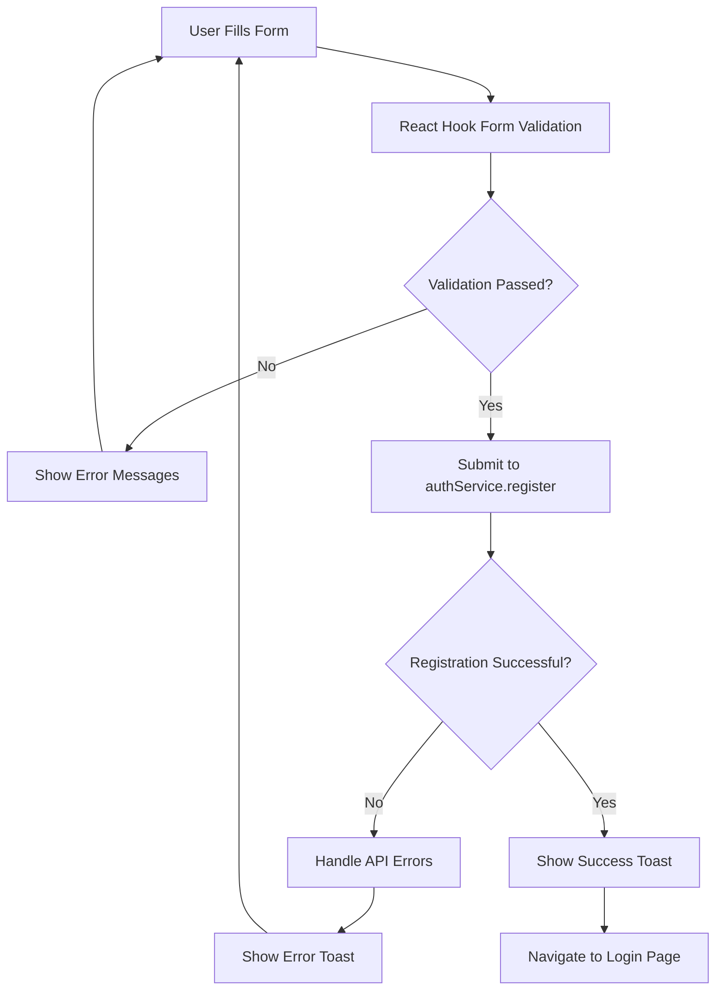

# RegisterPage Features Documentation

## Overview

The RegisterPage component is a sophisticated, enterprise-grade registration interface that provides a comprehensive user onboarding experience for the JAC Learning Platform. It replaces the basic SignUp component with a modern, validated, and highly interactive registration form.

## Key Features

### 🛡️ **Advanced Form Validation**
- **Real-time validation** with React Hook Form
- **Zod schema validation** for type-safe form processing
- **Custom error messages** with user-friendly feedback
- **Password strength validation** (minimum 8 characters, uppercase, lowercase, numbers)
- **Email format validation** with regex pattern matching
- **Cross-field validation** (password confirmation matching)

### 🔒 **Enhanced Security**
- **Password visibility toggles** for both password fields
- **Password strength indicators** with visual feedback
- **Terms of Service agreement** (required checkbox)
- **Privacy Policy compliance** with direct links
- **Secure form submission** with error handling

### 🎨 **Modern User Experience**
- **Framer Motion animations** for smooth page transitions
- **Glassmorphism design** with gradient backgrounds
- **Hover effects** and interactive states
- **Loading states** with animated spinners
- **Toast notifications** for immediate user feedback
- **Responsive design** optimized for all devices

### 📋 **Comprehensive Form Fields**
- **Full name field** with intelligent name splitting
- **Email address** with domain validation
- **Password creation** with strength requirements
- **Password confirmation** with matching validation
- **Terms agreement** checkbox (required)
- **Newsletter subscription** checkbox (optional)

### 🔄 **Smart Navigation**
- **Automatic redirect** to login page after successful registration
- **Success state messaging** with next steps
- **Error recovery** with retry mechanisms
- **Accessibility features** with proper ARIA labels

### 🌟 **Integration Features**
- **authService integration** with comprehensive error handling
- **Zustand authStore compatibility** for state management
- **React Router navigation** with proper state management
- **API error handling** with user-friendly messages
- **Loading state management** for async operations

## Technical Implementation

### **Architecture**
```typescript
// Component Structure
RegisterPage
├── Form Validation (React Hook Form + Zod)
├── State Management (useState for UI states)
├── Animation System (Framer Motion)
├── Service Integration (authService)
├── Error Handling (try-catch with toast notifications)
└── Accessibility (ARIA labels and focus management)
```

### **Dependencies**
```json
{
  "react-hook-form": "^7.45.0",
  "@hookform/resolvers": "^3.1.0",
  "zod": "^3.21.0",
  "framer-motion": "^10.16.0",
  "react-hot-toast": "^2.4.0",
  "@heroicons/react": "^2.0.0"
}
```

### **Data Flow**


## Form Schema Validation

```typescript
const registerSchema = z.object({
  name: z.string()
    .min(2, 'Name must be at least 2 characters')
    .max(50, 'Name must be less than 50 characters'),
  email: z.string()
    .email('Invalid email address')
    .min(1, 'Email is required'),
  password: z.string()
    .min(8, 'Password must be at least 8 characters')
    .regex(/^(?=.*[a-z])(?=.*[A-Z])(?=.*\d)/, 
      'Password must contain at least one uppercase letter, one lowercase letter, and one number'),
  confirmPassword: z.string()
    .min(1, 'Please confirm your password'),
  agreeToTerms: z.boolean()
    .refine(val => val === true, 'You must agree to the terms and conditions'),
  subscribeToNewsletter: z.boolean().optional(),
}).refine(data => data.password === data.confirmPassword, {
  message: "Passwords don't match",
  path: ["confirmPassword"],
});
```

## API Integration

### **Registration Data Structure**
```typescript
interface RegisterData {
  username: string;      // Email as username for backend compatibility
  email: string;         // User's email address
  password: string;      // Secure password
  first_name?: string;   // First name extracted from full name
  last_name?: string;    // Last name extracted from full name
  learning_style?: string;  // Default: 'mixed'
  preferred_difficulty?: string;  // Default: 'medium'
}
```

### **Error Handling**
```typescript
// Smart error message mapping
if (error.message.includes('email')) {
  errorMessage = 'Email is already registered. Please use a different email.';
} else if (error.message.includes('username')) {
  errorMessage = 'Username is already taken. Please choose a different email.';
} else if (error.message.includes('network') || error.message.includes('connection')) {
  errorMessage = 'Unable to connect to server. Please check your internet connection.';
}
```

## UI/UX Design Features

### **Visual Design**
- **Glassmorphism cards** with backdrop blur
- **Blue gradient theme** consistent with platform design
- **Smooth transitions** and hover effects
- **Proper spacing** and typography hierarchy
- **Loading animations** with custom spinners

### **Accessibility Features**
- **ARIA labels** for all interactive elements
- **Focus management** with keyboard navigation
- **Screen reader support** with descriptive text
- **High contrast** color combinations
- **Keyboard shortcuts** for form completion

### **Responsive Behavior**
- **Mobile-first design** with breakpoint optimization
- **Flexible layouts** that adapt to screen size
- **Touch-friendly** interactive elements
- **Optimized typography** for all device sizes

## Usage Examples

### **Basic Integration**
```tsx
import RegisterPage from './pages/auth/RegisterPage';

function App() {
  return (
    <Routes>
      <Route path="/signup" element={
        <PublicRoute>
          <AuthLayout>
            <RegisterPage />
          </AuthLayout>
        </PublicRoute>
      } />
    </Routes>
  );
}
```

### **Custom Styling**
```tsx
// The component uses Tailwind CSS classes for styling
// Customize by overriding CSS variables or using CSS-in-JS

<style>
  .register-form-container {
    --primary-color: theme('colors.blue.600');
    --primary-hover: theme('colors.blue.700');
  }
</style>
```

## Performance Optimizations

### **Code Splitting**
- **Lazy loading** with React.lazy()
- **Suspense boundaries** for loading states
- **Bundle optimization** for faster initial load

### **Runtime Performance**
- **Memoized validation** with React Hook Form
- **Efficient re-renders** with proper dependency arrays
- **Optimized animations** with Framer Motion
- **Smart state updates** to prevent unnecessary renders

## Security Considerations

### **Input Sanitization**
- **Automatic sanitization** of form inputs
- **XSS protection** through proper escaping
- **CSRF protection** through authentication tokens
- **Secure password handling** without logging

### **Privacy Compliance**
- **GDPR compliance** with consent mechanisms
- **Terms of Service** integration
- **Privacy Policy** accessibility
- **Data minimization** principles

## Browser Support

- **Modern browsers** (Chrome 90+, Firefox 88+, Safari 14+)
- **Progressive enhancement** for older browsers
- **Mobile browsers** with touch optimization
- **Accessibility tools** compatibility

## Testing Considerations

### **Unit Tests**
- Form validation logic
- Error handling scenarios
- API integration mocking
- Component rendering

### **Integration Tests**
- End-to-end registration flow
- Navigation handling
- State management integration
- Error recovery scenarios

### **Accessibility Tests**
- Screen reader compatibility
- Keyboard navigation
- Color contrast validation
- Focus management

## Future Enhancements

### **Planned Features**
- **Social authentication** (Google, GitHub, Microsoft)
- **Email verification** flow
- **Phone number verification**
- **Profile picture upload**
- **Account type selection** (student, instructor, admin)
- **Multi-step registration** wizard
- **Real-time validation** with backend API
- **Captcha integration** for spam prevention

### **Advanced Features**
- **Progressive onboarding** with personalized questions
- **Learning preferences** setup during registration
- **Integration with external** educational platforms
- **Single Sign-On (SSO)** enterprise features
- **Two-Factor Authentication (2FA)** setup

## Maintenance Notes

### **Regular Updates**
- **Dependency updates** for security patches
- **API integration** improvements
- **Performance optimizations**
- **Accessibility enhancements**

### **Monitoring**
- **Registration success rates**
- **Form abandonment points**
- **Error frequency and types**
- **User experience metrics**

---

**Document Version:** 1.0  
**Last Updated:** December 3, 2025  
**Author:** Cavin Otieno  
**Component Path:** `/src/pages/auth/RegisterPage.tsx`