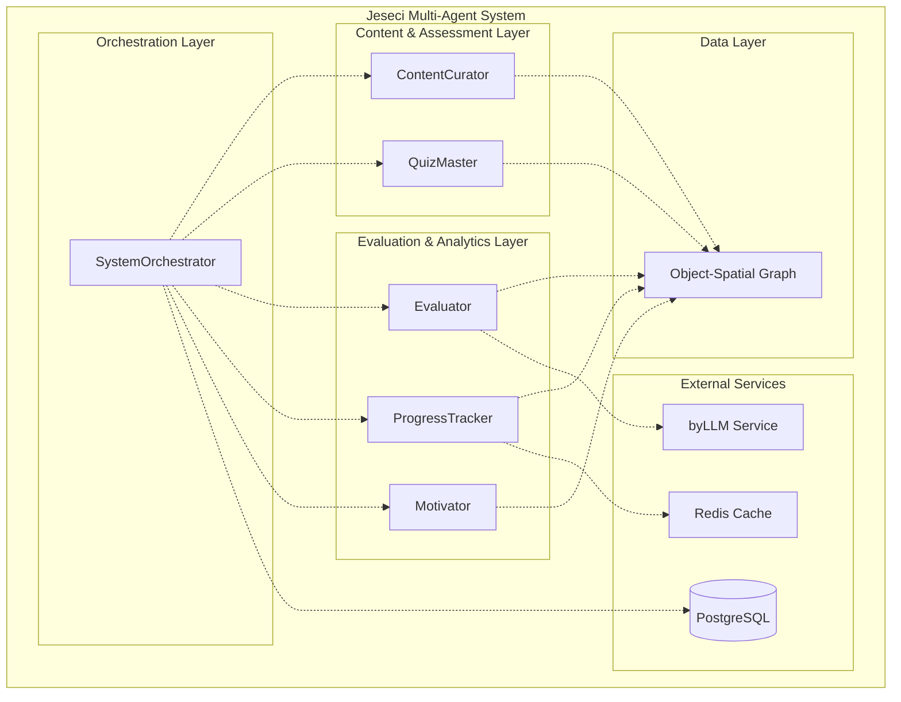
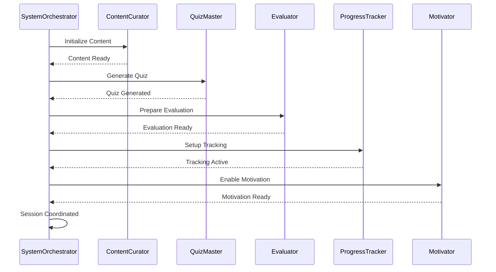
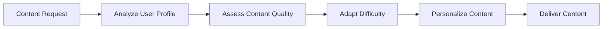
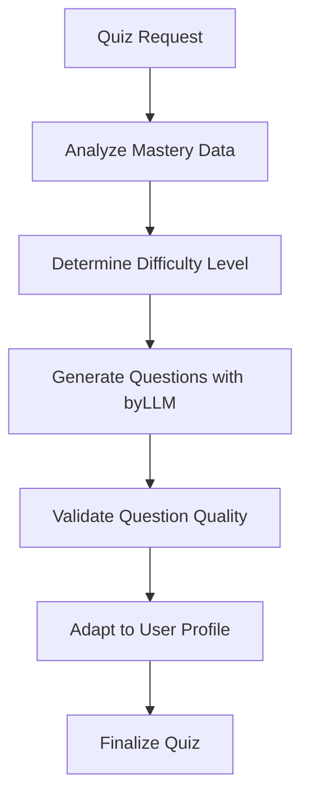
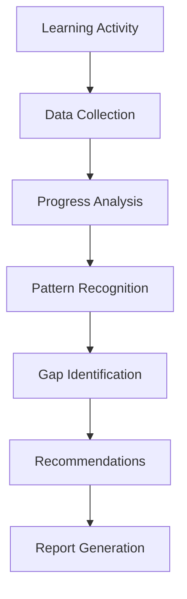
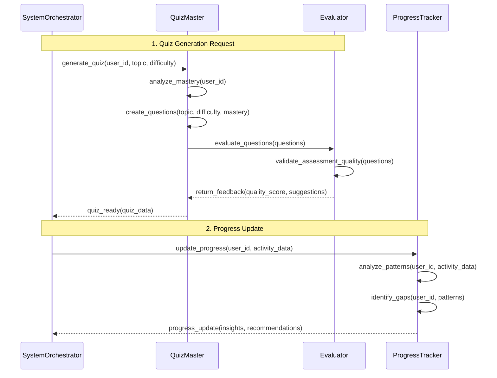
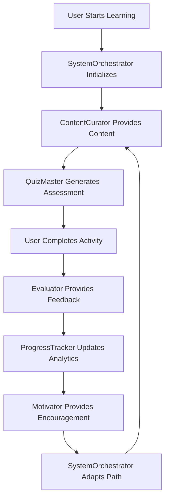
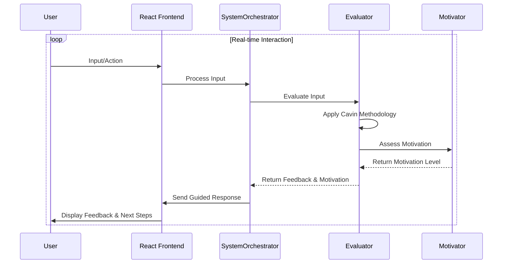

# Multi-Agent System (MAS) Documentation

**Author**: Cavin Otieno  
**Version**: 1.0.0  
**Last Updated**: 2025-12-02 04:26:27  

## 🤖 Multi-Agent System Overview

The Jeseci Interactive Learning Platform employs a sophisticated Multi-Agent System (MAS) built with Jac Programming Language, featuring six specialized agents that collaborate to provide adaptive, intelligent learning experiences.

### 🏗️ Agent Architecture



## 🎯 Agent Specifications

### 1. SystemOrchestrator (Central Coordinator)

**Purpose**: Orchestrates all agent activities and manages overall system workflow

**Responsibilities**:
- Initialize user learning sessions
- Coordinate agent interactions
- Manage global system state
- Handle error recovery and system resilience
- Route requests between agents

**Key Methods**:
```jac
@JacWalker
@byLLM
def initialize_learning_session(user_id: int) -> Dict[str, Any]:
    """Initialize complete learning environment for a user"""
    
@JacWalker  
def coordinate_agent_workflow(workflow_type: str, user_id: int) -> Dict[str, Any]:
    """Coordinate multi-agent workflow execution"""
    
@JacWalker
def manage_system_state(operation: str, data: Any) -> Dict[str, Any]:
    """Manage global system state and synchronization"""
```

**Communication Pattern**:


### 2. ContentCurator (Content Manager)

**Purpose**: Manages learning materials, content quality, and content personalization

**Responsibilities**:
- Curate and organize learning content
- Ensure content quality and relevance
- Adapt content difficulty based on user progress
- Manage content versioning and updates
- Coordinate with external content sources

**Key Methods**:
```jac
@JacWalker
@byLLM
def curate_learning_content(user_id: int, topic: str, difficulty: str) -> Dict[str, Any]:
    """Curate personalized learning content based on user profile"""
    
@JacWalker
def assess_content_quality(content_id: str) -> Dict[str, Any]:
    """Assess and improve content quality using AI analysis"""
    
@JacWalker
def adapt_content_difficulty(content_id: str, user_mastery: Dict[str, float]) -> Dict[str, Any]:
    """Adapt content difficulty to match user skill level"""
```

**Content Flow**:


### 3. QuizMaster (Assessment Generator)

**Purpose**: Generates adaptive quizzes and assessments using AI and user progress data

**Responsibilities**:
- Generate personalized quizzes using byLLM
- Adapt question difficulty based on user mastery
- Create various question types (multiple choice, coding, essay)
- Ensure assessment fairness and validity
- Maintain question bank quality

**Key Methods**:
```jac
@JacWalker
@byLLM
def generate_adaptive_quiz(user_id: int, topic: str, quiz_type: str) -> Dict[str, Any]:
    """Generate personalized quiz using user's mastery data"""
    
@JacWalker
def adapt_question_difficulty(question: Dict[str, Any], user_performance: Dict[str, Any]) -> Dict[str, Any]:
    """Dynamically adjust question difficulty based on user performance"""
    
@JacWalker
def validate_assessment_quality(quiz_data: Dict[str, Any]) -> Dict[str, Any]:
    """Validate quiz quality and fairness using AI analysis"""
```

**Quiz Generation Process**:


### 4. Evaluator (Intelligent Assessment)

**Purpose**: Provides intelligent code evaluation and feedback using Cavin Otieno's methodology

**Responsibilities**:
- Evaluate code submissions with multi-dimensional analysis
- Provide constructive, personalized feedback
- Assess learning progress and skill development
- Generate improvement recommendations
- Support both automated and AI-assisted evaluation

**Cavin Otieno's Evaluation Framework**:
```python
evaluation_framework = {
    'technical_accuracy': 0.3,      # 30% - Code correctness
    'code_quality': 0.25,           # 25% - Structure and practices
    'problem_solving': 0.25,        # 25% - Logic and approach
    'communication': 0.2            # 20% - Clarity and explanation
}
```

**Key Methods**:
```jac
@JacWalker
@byLLM
def evaluate_code_submission(user_id: int, quiz_id: str, code: str, language: str) -> Dict[str, Any]:
    """Evaluate code using Cavin Otieno's multi-dimensional assessment"""
    
@JacWalker
@byLLM
def evaluate_text_response(user_id: int, quiz_id: str, response: str, question_type: str) -> Dict[str, Any]:
    """Evaluate text responses using intelligent assessment"""
    
@JacWalker
def provide_real_time_feedback(user_id: int, current_input: str, context: str) -> Dict[str, Any]:
    """Provide real-time feedback during learning session"""
```

### 5. ProgressTracker (Analytics Engine)

**Purpose**: Monitors learning progress, generates analytics, and provides insights

**Responsibilities**:
- Track user learning progress and patterns
- Generate comprehensive analytics and reports
- Identify learning gaps and opportunities
- Monitor system-wide performance metrics
- Provide data for adaptive algorithms

**Key Methods**:
```jac
@JacWalker
@byLLM
def track_learning_progress(user_id: int, activity_data: Dict[str, Any]) -> Dict[str, Any]:
    """Track and analyze user learning progress"""
    
@JacWalker
def generate_analytics_report(user_id: int, time_period: str) -> Dict[str, Any]:
    """Generate comprehensive learning analytics"""
    
@JacWalker
def identify_learning_gaps(user_id: int) -> Dict[str, Any]:
    """Identify areas where user needs additional support"""
```

**Analytics Data Flow**:


### 6. Motivator (Engagement Engine)

**Purpose**: Provides motivation, gamification, and encouragement to maintain engagement

**Responsibilities**:
- Implement gamification elements and achievements
- Provide personalized motivation and encouragement
- Manage reward systems and progress celebrations
- Detect and address motivation gaps
- Foster growth mindset and positive learning attitudes

**Key Methods**:
```jac
@JacWalker
@byLLM
def provide_motivation(user_id: int, motivation_type: str, context: Dict[str, Any]) -> Dict[str, Any]:
    """Provide personalized motivation and encouragement"""
    
@JacWalker
def manage_achievements(user_id: int, achievement_data: Dict[str, Any]) -> Dict[str, Any]:
    """Manage gamification achievements and rewards"""
    
@JacWalker
def assess_engagement_level(user_id: int) -> Dict[str, Any]:
    """Assess user engagement and motivation levels"""
```

**Gamification Elements**:
- **Achievement Badges**: Visual progress indicators
- **Streak Tracking**: Daily learning streak rewards
- **Skill Trees**: Progressive skill development paths
- **Leaderboards**: Friendly competition elements
- **Progress Visualization**: Clear progress indicators

## 🔄 Inter-Agent Communication

### Message Passing Protocol


### Shared State Management
```python
# OSP Graph Structure
class OSPNode:
    user_id: int
    node_type: str  # User, Lesson, Quiz, Concept
    mastery_score: float
    connections: List[OSPNode]

class OSPEdge:
    source: OSPNode
    target: OSPNode
    edge_type: str  # prerequisite, mastery_score, completion
    weight: float

# Agent Coordination
agents = {
    'orchestrator': SystemOrchestrator(),
    'content_curator': ContentCurator(),
    'quiz_master': QuizMaster(),
    'evaluator': Evaluator(),
    'progress_tracker': ProgressTracker(),
    'motivator': Motivator()
}
```

## 🎯 Learning Flow Integration

### Adaptive Learning Loop


### Real-time Feedback Loop


## 📊 Performance Metrics

### Agent Effectiveness Metrics
- **Response Time**: Average processing time per request
- **Accuracy**: Quality of assessments and recommendations
- **User Engagement**: Impact on user learning motivation
- **Adaptation Quality**: Effectiveness of personalized content

### System-Wide Metrics
- **Coordination Efficiency**: Agent collaboration effectiveness
- **Learning Outcome Improvement**: User progress tracking
- **System Reliability**: Uptime and error rates
- **Scalability**: Performance under increased load

## 🔧 Technical Implementation

### Jac Programming Language Features
```jac
# Agent Walker Definition
@JacWalker
@byLLM
class LearningAgent:
    def __init__(self):
        self.agent_type = "learning_specialist"
        self.capabilities = ["assessment", "feedback", "adaptation"]
    
    @JacWalker
    def process_request(self, request_data: Dict[str, Any]) -> Dict[str, Any]:
        # Agent logic implementation
        pass

# Object-Spatial Graph Integration
@JacNode
class OSPNode:
    def __init__(self, node_type: str, data: Dict[str, Any]):
        self.node_type = node_type
        self.data = data
        self.connections = []
```

### Integration with Django
```python
# Django Integration
from jac_layer.jac_manager import JacManager

class LearningAPIView(APIView):
    def post(self, request):
        # Initialize Multi-Agent System
        jac_manager = JacManager()
        
        # Process learning request
        result = jac_manager.process_learning_request(
            user_id=request.user.id,
            activity_type=request.data.get('activity_type'),
            content=request.data.get('content')
        )
        
        return Response(result)
```

## 🔮 Future Enhancements

### Planned Agent Capabilities
- **Advanced Personalization**: Enhanced user profiling and adaptation
- **Cross-Platform Learning**: Multi-device learning continuity
- **Collaborative Learning**: Peer-to-peer learning facilitation
- **Emotional Intelligence**: Sentiment analysis and emotional support
- **Predictive Analytics**: Learning outcome prediction and prevention

### Scalability Improvements
- **Distributed Agent Execution**: Multi-node agent deployment
- **Agent Specialization**: Domain-specific agent variants
- **Dynamic Agent Addition**: Runtime agent registration
- **Load Balancing**: Intelligent request distribution

---

**Next Steps**: Review [Component Diagram](component_diagram.md) for system decomposition and [Sequence Diagram](sequence_diagram.md) for detailed process flows.