# Sequence Diagram

**Author**: Cavin Otieno  
**Version**: 1.0.0  
**Last Updated**: 2025-12-02 04:26:27  

## 🔄 System Interaction Flows

This document outlines the key sequence diagrams for the Jeseci Interactive Learning Platform, showing how different system components interact over time to provide adaptive learning experiences.

## 🚀 Complete Learning Session Flow

### Main Learning Workflow
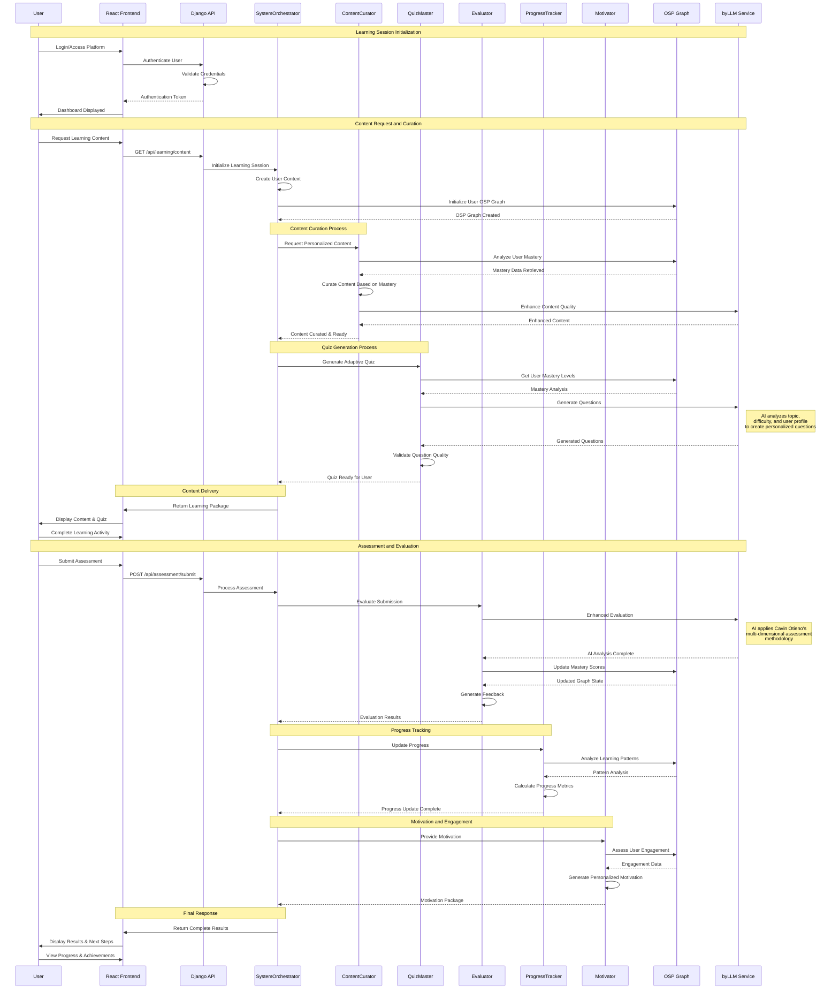

## 🔄 Real-Time Code Evaluation Flow

### Live Code Assessment
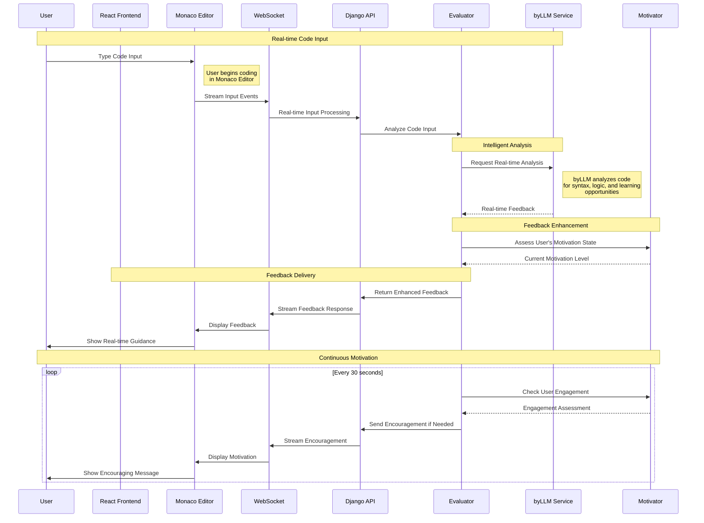

## 📊 Progress Analytics Flow

### Learning Analytics Processing
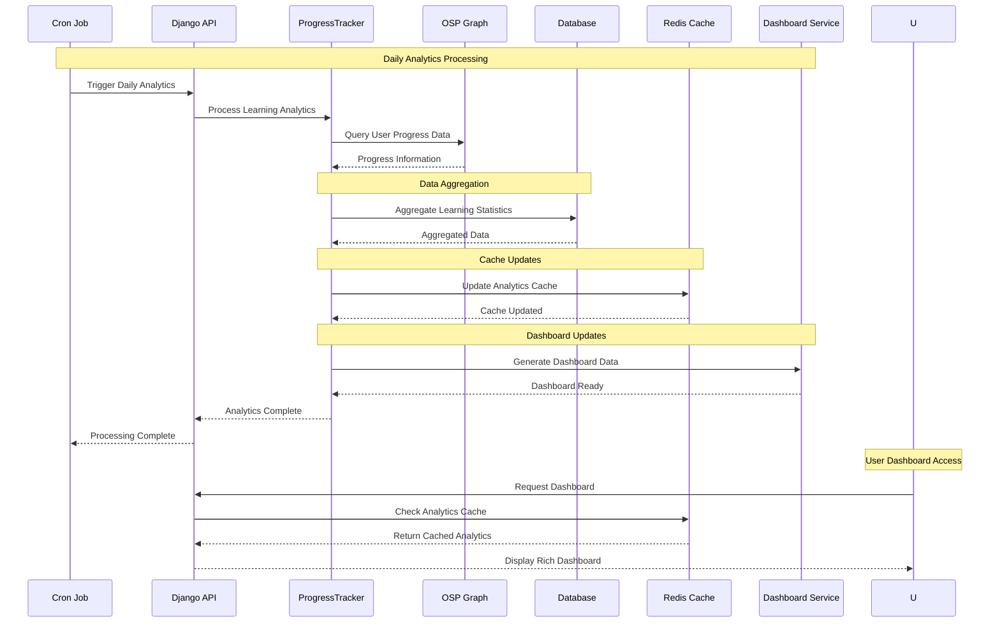

## 🎯 Adaptive Content Flow

### Content Adaptation Process
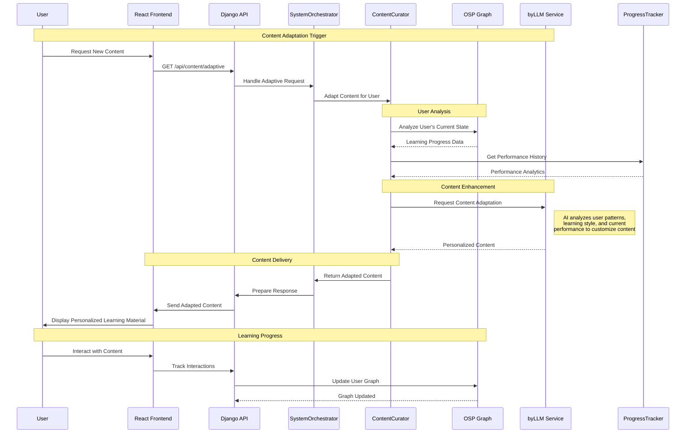

## 🔐 Authentication & Authorization Flow

### Secure Access Process
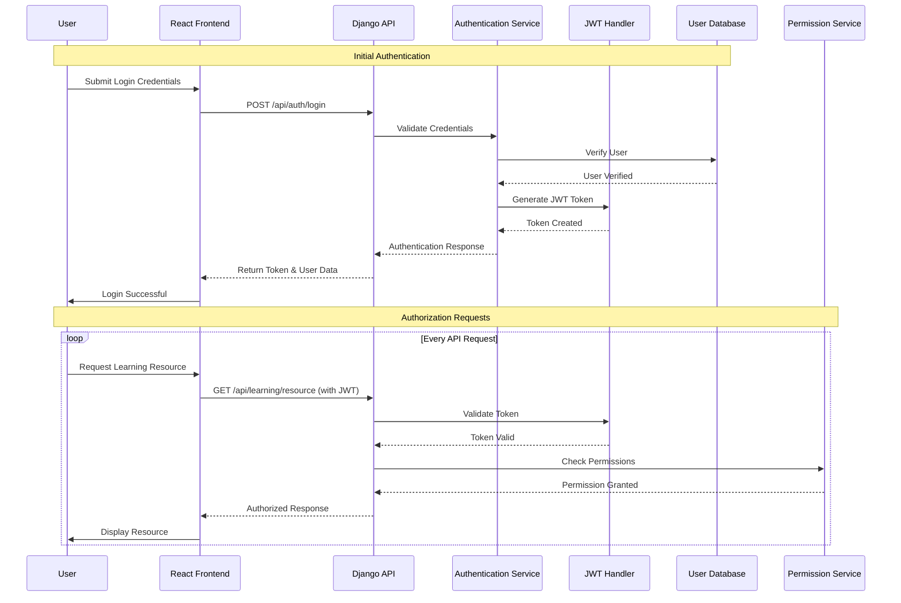

## 🚀 Deployment & Scaling Flow

### System Deployment Process
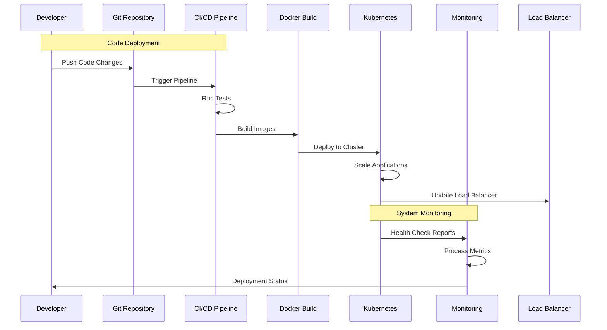

## 📈 Performance Monitoring Flow

### Real-time System Monitoring
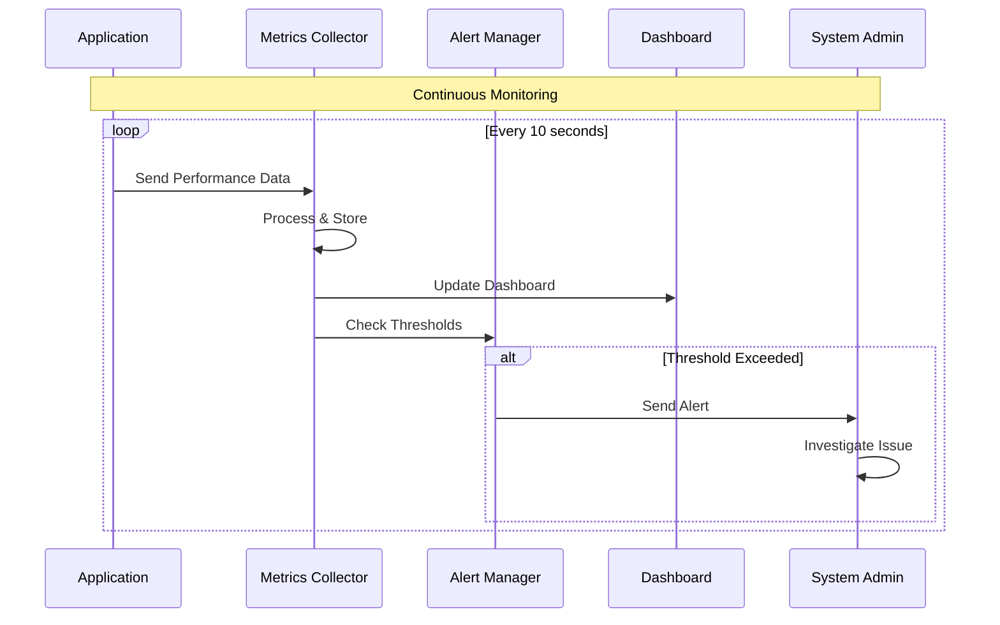

## 🎮 Gamification Flow

### Achievement and Motivation System
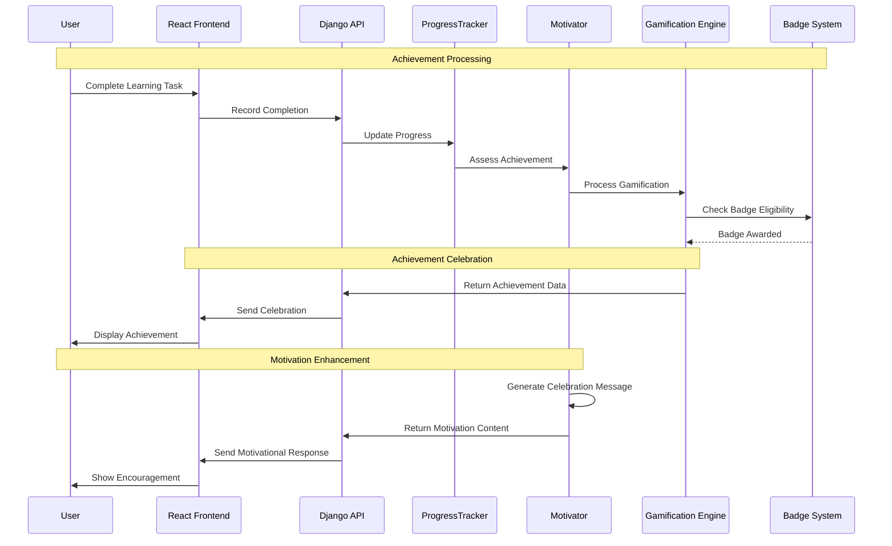

## 🔄 Error Recovery Flow

### System Resilience and Recovery
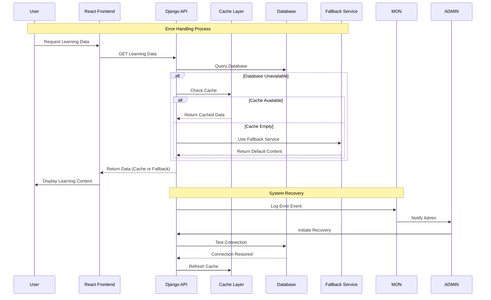

## 📱 Multi-Platform Synchronization Flow

### Cross-Device Learning Continuity
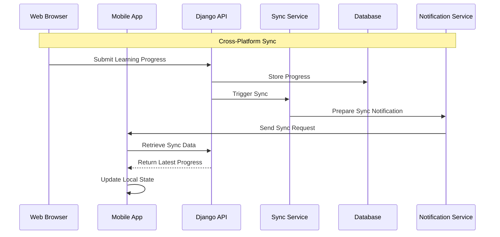

## 🔍 Search and Discovery Flow

### Intelligent Content Discovery
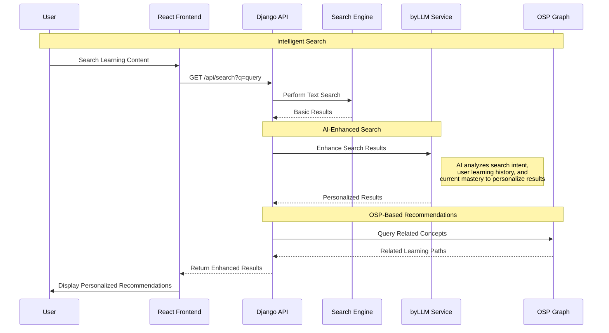

---

**Next Steps**: Review [Use Case Diagram](use_case_diagram.md) for user interaction scenarios and [Activity Diagram](activity_diagram.md) for detailed workflow processes.