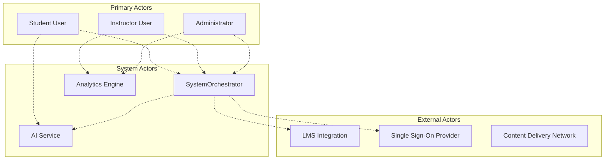
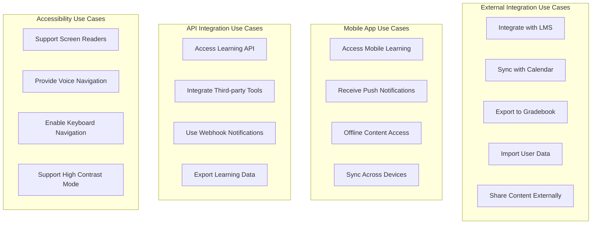
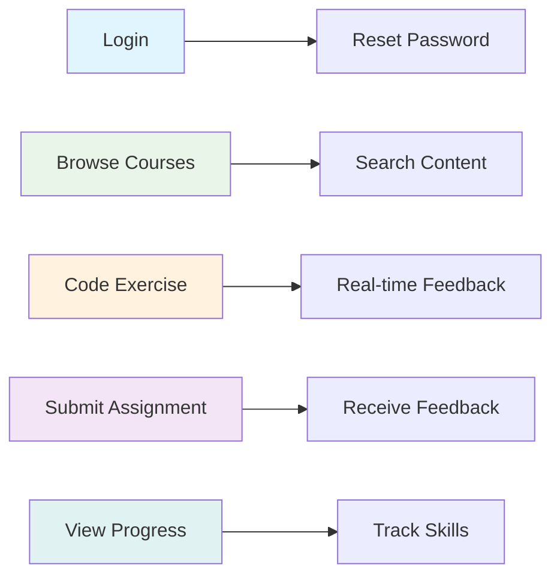
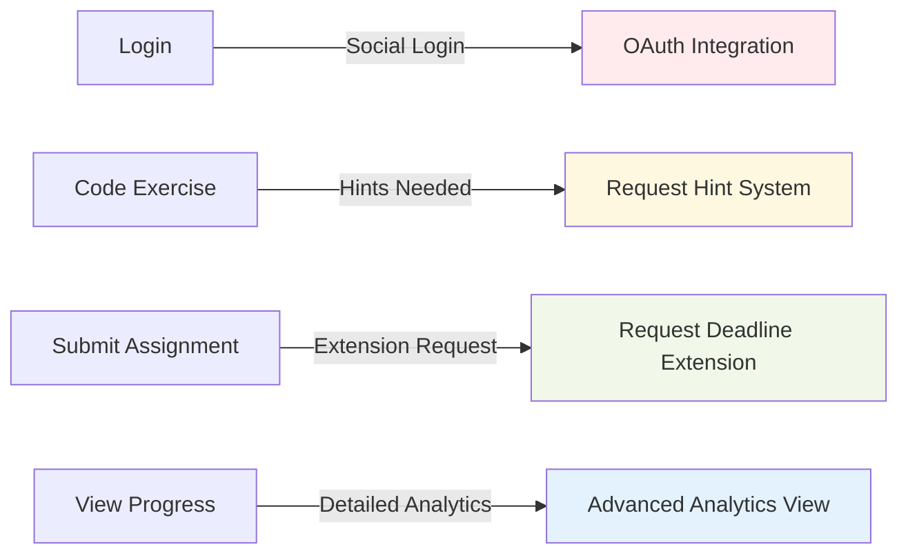
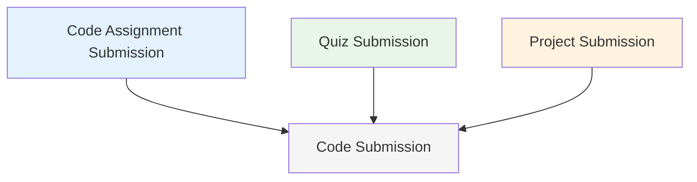

# Use Case Diagram

**Author**: Cavin Otieno  
**Version**: 1.0.0  
**Last Updated**: 2025-12-02 04:26:27  

## 👥 User Interaction Scenarios

This document outlines all the use cases for the Jeseci Interactive Learning Platform, showing how different types of users interact with the system to achieve their learning objectives.

## 🎯 Primary Actors

### System Actors

## 📚 Student Use Cases

### Core Learning Activities

```mermaid
graph TD
    subgraph "Student User"
        S[Student]
    end
    
    subgraph "Authentication Use Cases"
        UC1[Login to Platform]
        UC2[Reset Password]
        UC3[Manage Profile]
    end
    
    subgraph "Learning Content Use Cases"
        UC4[Browse Available Courses]
        UC5[Search Learning Materials]
        UC6[View Course Catalog]
        UC7[Read Learning Materials]
        UC8[Watch Video Lectures]
    end
    
    subgraph "Interactive Learning Use Cases"
        UC9[Code Programming Exercises]
        UC10[Complete Interactive Quizzes]
        UC11[Participate in Code Reviews]
        UC12[Use Code Editor]
    end
    
    subgraph "Assessment Use Cases"
        UC13[Submit Code Assignments]
        UC14[Take Adaptive Assessments]
        UC15[Receive Detailed Feedback]
        UC16[Review Assessment Results]
    end
    
    subgraph "Progress Tracking Use Cases"
        UC17[View Learning Progress]
        UC18[Track Skill Development]
        UC19[View Achievement Badges]
        UC20[Monitor Completion Status]
    end
    
    subgraph "Gamification Use Cases"
        UC21[Earn Achievement Badges]
        UC22[Maintain Learning Streaks]
        UC23[View Leaderboard]
        UC24[Share Achievements]
    end
    
    subgraph "Social Learning Use Cases"
        UC25[Join Study Groups]
        UC26[Collaborate on Projects]
        UC27[Participate in Discussions]
        UC28[Peer Code Reviews]
    end
    
    S --> UC1
    S --> UC4
    S --> UC9
    S --> UC13
    S --> UC17
    S --> UC21
    S --> UC25
```

### Detailed Student Use Case Scenarios

#### UC1: Login to Platform
**Actor**: Student  
**Primary Flow**:
1. Student navigates to login page
2. Student enters email/username and password
3. System validates credentials
4. System authenticates user via JWT
5. System redirects to personalized dashboard

**Alternative Flows**:
- **Invalid Credentials**: Display error message, allow retry
- **Password Reset**: Send password reset email
- **Social Login**: Authenticate via Google/GitHub SSO

#### UC4: Browse Available Courses
**Actor**: Student  
**Primary Flow**:
1. Student accesses course catalog
2. System displays available courses
3. Student filters by category, difficulty, or topic
4. System shows course previews and prerequisites
5. Student selects course of interest

**Alternative Flows**:
- **Course Unavailable**: Display waitlist option
- **Prerequisite Missing**: Show required courses
- **Course Recommendations**: AI suggests relevant courses

#### UC9: Code Programming Exercises
**Actor**: Student  
**Primary Flow**:
1. Student opens coding exercise
2. System loads Monaco Code Editor
3. Student writes code solution
4. System provides real-time feedback
5. Student submits code for evaluation
6. System evaluates using Cavin Otieno's methodology
7. Student receives detailed feedback and next steps

**Alternative Flows**:
- **Syntax Error**: Display immediate syntax feedback
- **Runtime Error**: Show error details and hints
- **Partial Solution**: Provide incremental feedback
- **Multiple Attempts**: Allow revision based on feedback

#### UC13: Submit Code Assignments
**Actor**: Student  
**Primary Flow**:
1. Student completes coding assignment
2. Student submits code through platform
3. SystemOrchestrator coordinates evaluation
4. Evaluator agent processes submission
5. AI service analyzes code quality
6. System generates comprehensive feedback
7. Student receives evaluation results
8. System updates learning progress

**Alternative Flows**:
- **Submission Timeout**: Allow extension request
- **Compilation Error**: Provide specific error location
- **Code Plagiarism**: Run integrity checks
- **Late Submission**: Apply late penalty rules

## 👨‍🏫 Instructor Use Cases

### Content and Assessment Management

```mermaid
graph TD
    subgraph "Instructor User"
        I[Instructor]
    end
    
    subgraph "Content Management Use Cases"
        UC29[Create Learning Content]
        UC30[Edit Course Materials]
        UC31[Upload Video Lectures]
        UC32[Create Interactive Exercises]
        UC33[Manage Course Structure]
    end
    
    subgraph "Assessment Design Use Cases"
        UC34[Design Code Assignments]
        UC35[Create Adaptive Quizzes]
        UC36[Set Evaluation Criteria]
        UC37[Configure Rubrics]
        UC38[Create Code Test Cases]
    end
    
    subgraph "Student Management Use Cases"
        UC39[View Student Progress]
        UC40[Monitor Class Performance]
        UC41[Provide Additional Feedback]
        UC42[Assign Makeup Work]
        UC43[Track Attendance]
    end
    
    subgraph "Analytics and Reporting Use Cases"
        UC44[Generate Progress Reports]
        UC45[Analyze Learning Patterns]
        UC46[Export Grade Data]
        UC47[Create Performance Dashboards]
        UC48[Monitor Assessment Quality]
    end
    
    I --> UC29
    I --> UC34
    I --> UC39
    I --> UC44
```

#### UC29: Create Learning Content
**Actor**: Instructor  
**Primary Flow**:
1. Instructor accesses content creation tools
2. Instructor selects content type (text, video, interactive)
3. System provides content templates
4. Instructor creates content with multimedia
5. System validates content quality
6. Instructor previews content
7. System publishes content to course

**Alternative Flows**:
- **Content Rejection**: Provide editing suggestions
- **Media Upload Issues**: Retry upload process
- **Quality Check Fail**: Revise content structure

## 🔧 Administrator Use Cases

### System Administration and Configuration

```mermaid
graph TD
    subgraph "Administrator User"
        A[Administrator]
    end
    
    subgraph "User Management Use Cases"
        UC49[Manage User Accounts]
        UC50[Create User Groups]
        UC51[Set Access Permissions]
        UC52[Handle User Support]
        UC53[Monitor User Activity]
    end
    
    subgraph "System Configuration Use Cases"
        UC54[Configure System Settings]
        UC55[Manage API Integrations]
        UC56[Set up SSO Providers]
        UC57[Configure Security Policies]
        UC58[Manage Backup Systems]
    end
    
    subgraph "Performance Monitoring Use Cases"
        UC59[Monitor System Performance]
        UC60[Analyze Usage Statistics]
        UC61[Generate System Reports]
        UC62[Handle Performance Alerts]
        UC63[Optimize System Resources]
    end
    
    subgraph "Content Administration Use Cases"
        UC64[Approve Course Content]
        UC65[Manage Content Library]
        UC66[Handle Content Moderation]
        UC67[Manage Course Catalog]
        UC68[Configure Content Delivery]
    end
    
    A --> UC49
    A --> UC54
    A --> UC59
    A --> UC64
```

#### UC49: Manage User Accounts
**Actor**: Administrator  
**Primary Flow**:
1. Administrator accesses user management interface
2. System displays all user accounts
3. Administrator performs account operations:
   - Create new user accounts
   - Modify user permissions
   - Reset user passwords
   - Deactivate suspicious accounts
4. System updates user database
5. Administrator receives confirmation

**Alternative Flows**:
- **Permission Conflicts**: Resolve access issues
- **Data Export**: Generate user reports
- **Bulk Operations**: Handle multiple user updates

## 🔄 System Use Cases

### Automated System Operations

```mermaid
graph TD
    subgraph "System Components"
        SYS[SystemOrchestrator]
        AI[AI Service]
        ANALYTICS[Analytics Engine]
    end
    
    subgraph "Automated Learning Use Cases"
        UC69[Generate Personalized Content]
        UC70[Adapt Learning Paths]
        UC71[Provide Real-time Feedback]
        UC72[Update Mastery Scores]
        UC73[Trigger Motivational Messages]
    end
    
    subgraph "Assessment Automation Use Cases"
        UC74[Auto-evaluate Submissions]
        UC75[Generate Adaptive Quizzes]
        UC76[Detect Code Plagiarism]
        UC77[Grade Assignments]
        UC78[Provide Instant Feedback]
    end
    
    subgraph "Analytics Automation Use Cases"
        UC79[Track Learning Progress]
        UC80[Generate Progress Reports]
        UC81[Identify Learning Gaps]
        UC82[Analyze Performance Patterns]
        UC83[Create Learning Recommendations]
    end
    
    subgraph "System Maintenance Use Cases"
        UC84[Perform Health Checks]
        UC85[Handle Error Recovery]
        UC86[Update Content Cache]
        UC87[Backup Learning Data]
        UC88[Monitor System Resources]
    end
    
    SYS --> UC69
    AI --> UC74
    ANALYTICS --> UC79
    SYS --> UC84
```

## 🌐 Extended Use Cases

### Integration and External Interactions

## 📊 Use Case Relationships

### Include Relationships

### Extend Relationships

### Generalization Relationships

## 🎯 Use Case Priority Matrix

| Priority | Use Case | Actor | Business Value | Complexity |
|----------|----------|-------|----------------|------------|
| **High** | UC1: Login | Student | Essential | Low |
| **High** | UC9: Code Exercise | Student | Core Learning | Medium |
| **High** | UC13: Submit Assignment | Student | Assessment | Medium |
| **High** | UC4: Browse Courses | Student | Content Discovery | Low |
| **Medium** | UC17: View Progress | Student | Motivation | Low |
| **Medium** | UC29: Create Content | Instructor | Content Management | High |
| **Medium** | UC39: View Student Progress | Instructor | Teaching Support | Medium |
| **Low** | UC49: Manage Users | Administrator | System Administration | Low |

## 📈 Use Case Success Metrics

### Key Performance Indicators
- **User Engagement**: Time spent on learning activities
- **Completion Rates**: Percentage of completed courses/assignments
- **Learning Outcomes**: Improvement in skill assessments
- **User Satisfaction**: Feedback scores and retention rates
- **System Performance**: Response times and uptime

### Success Criteria per Use Case
- **UC1 (Login)**: < 3 seconds authentication time, 99% success rate
- **UC9 (Code Exercise)**: < 5 seconds feedback response, 90% completion rate
- **UC13 (Submit Assignment)**: < 30 seconds evaluation time, detailed feedback
- **UC4 (Browse Courses)**: < 2 seconds catalog load, relevant recommendations
- **UC17 (View Progress)**: Real-time updates, clear progress visualization

---

**Next Steps**: Review [Activity Diagram](activity_diagram.md) for detailed workflow processes and [Class Diagram](class_diagram.md) for object-oriented design.