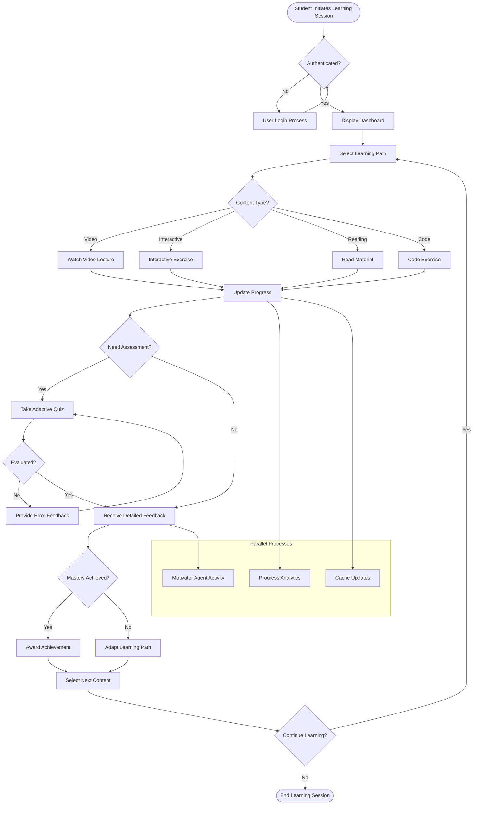
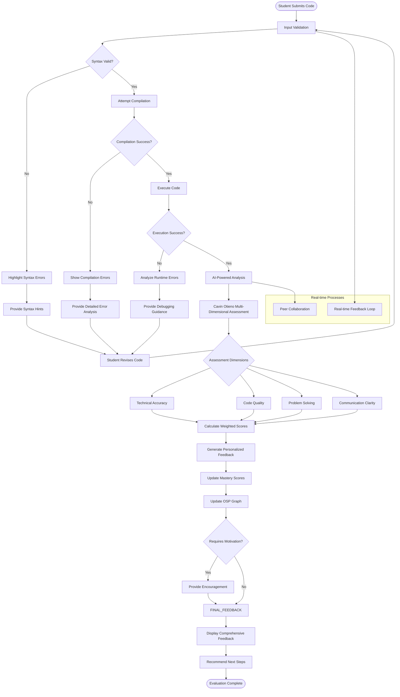
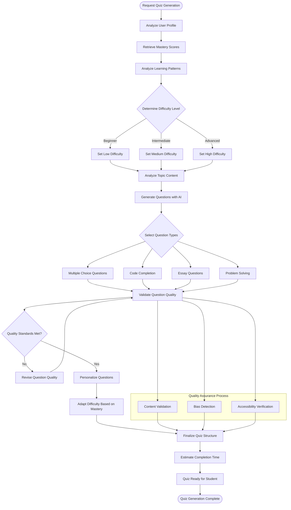
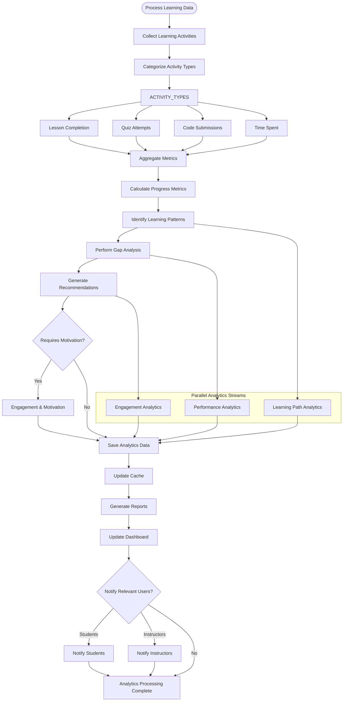
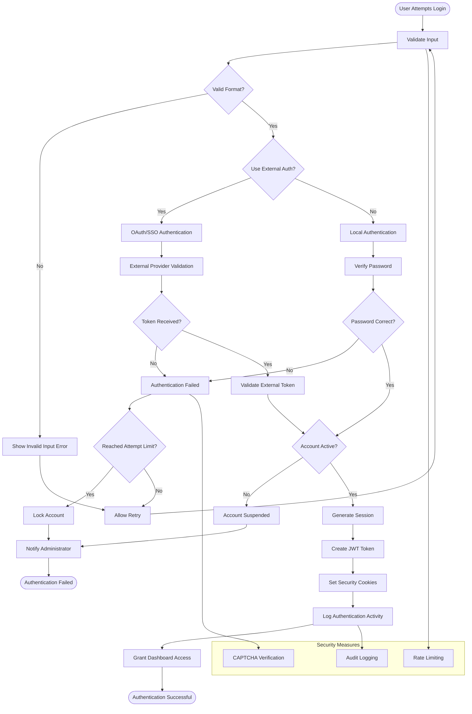
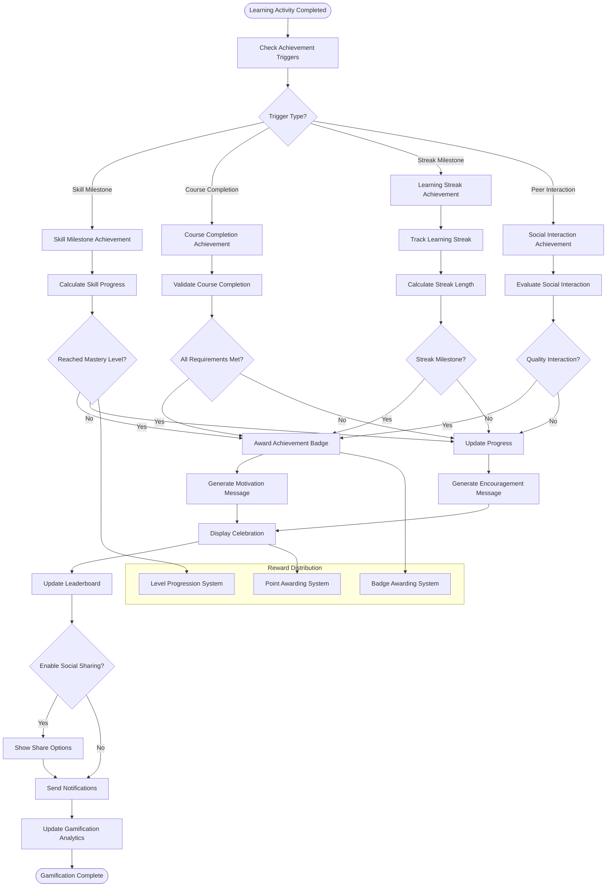
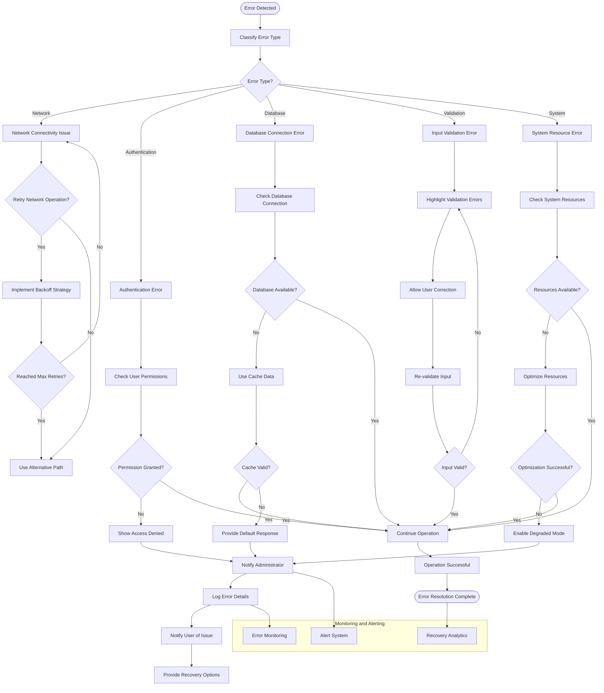
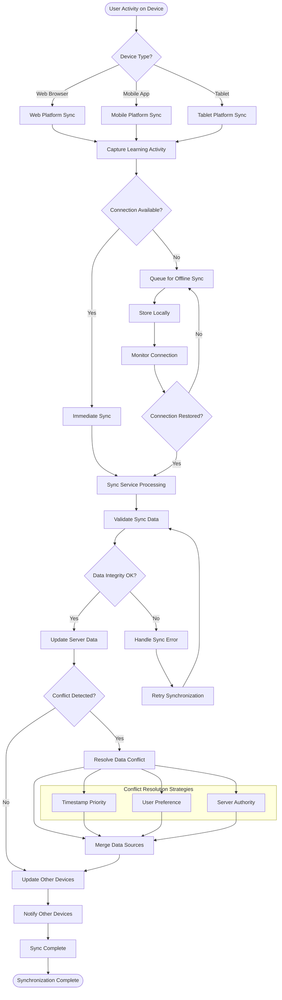

# Activity Diagram

**Author**: Cavin Otieno  
**Version**: 1.0.0  
**Last Updated**: 2025-12-02 04:26:27  

## 📋 Workflow Process Documentation

This document provides detailed activity diagrams for the key workflows in the Jeseci Interactive Learning Platform, showing the step-by-step processes for major system activities.

## 🚀 Student Learning Workflow

### Complete Learning Session Process

## 💻 Code Evaluation Workflow

### Intelligent Code Assessment Process

## 🎯 Quiz Generation Workflow

### Adaptive Assessment Creation Process

## 📊 Progress Analytics Workflow

### Learning Analytics Processing

## 🔐 Authentication Workflow

### Secure User Authentication Process

## 🎮 Gamification Workflow

### Achievement and Motivation System

## 🔧 Error Handling Workflow

### Comprehensive Error Recovery Process

## 📱 Multi-Platform Synchronization Workflow

### Cross-Device Learning Continuity

---

**Next Steps**: Review [Class Diagram](class_diagram.md) for object-oriented design and [API Reference](api_reference.yaml) for endpoint documentation.