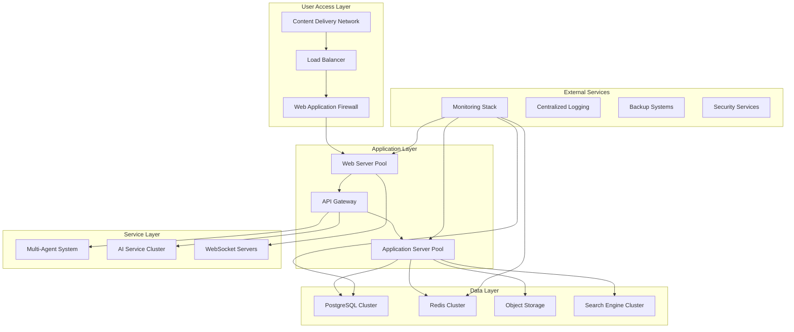
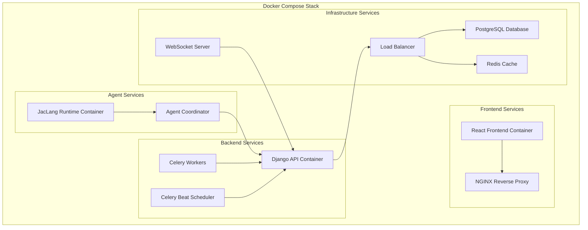
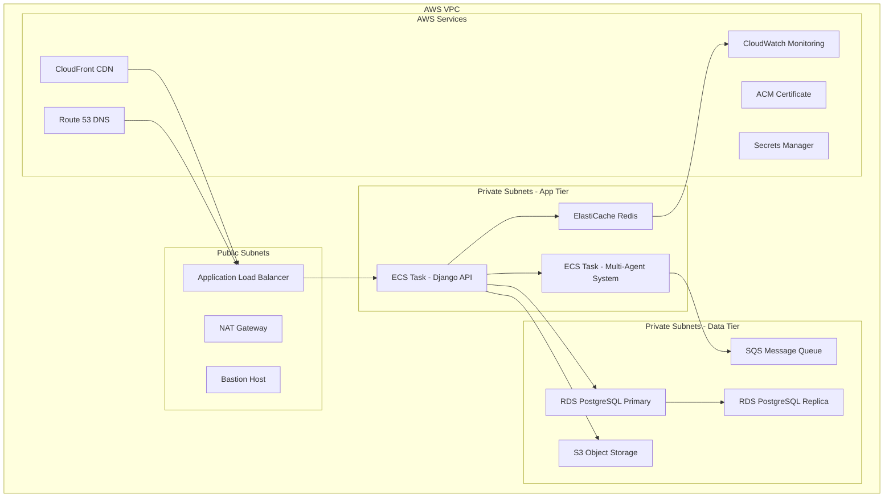
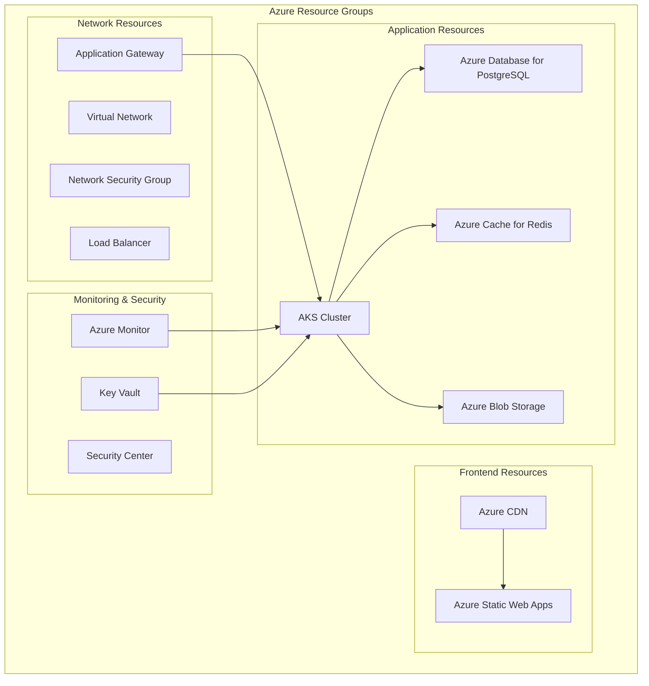
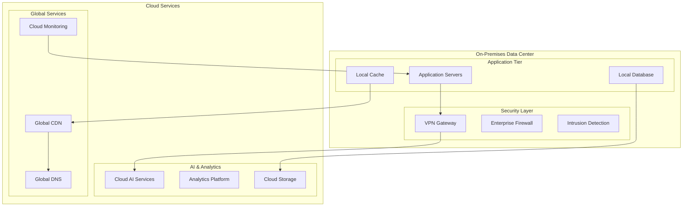

# Deployment Architecture

**Author**: Cavin Otieno  
**Version**: 1.0.0  
**Last Updated**: 2025-12-02 04:26:27  

## 🚀 Production Deployment Strategy

This document outlines the comprehensive deployment architecture for the Jeseci Interactive Learning Platform, covering infrastructure, scalability, monitoring, and operational best practices for enterprise-grade production environments.

## 🏗️ Infrastructure Overview

### High-Level Architecture


## 🐳 Containerized Deployment

### Docker Architecture


### Kubernetes Deployment
```yaml
# production/namespace.yaml
apiVersion: v1
kind: Namespace
metadata:
  name: jeseci-production

---
# production/deployment.yaml
apiVersion: apps/v1
kind: Deployment
metadata:
  name: jeseci-backend
  namespace: jeseci-production
spec:
  replicas: 5
  selector:
    matchLabels:
      app: jeseci-backend
  template:
    metadata:
      labels:
        app: jeseci-backend
    spec:
      containers:
      - name: django-app
        image: jeseci/backend:latest
        ports:
        - containerPort: 8000
        env:
        - name: DATABASE_URL
          valueFrom:
            secretKeyRef:
              name: jeseci-secrets
              key: database-url
        - name: REDIS_URL
          valueFrom:
            secretKeyRef:
              name: jeseci-secrets
              key: redis-url
        resources:
          requests:
            memory: "512Mi"
            cpu: "250m"
          limits:
            memory: "1Gi"
            cpu: "500m"
        livenessProbe:
          httpGet:
            path: /api/health/
            port: 8000
          initialDelaySeconds: 30
          periodSeconds: 10
        readinessProbe:
          httpGet:
            path: /api/health/ready/
            port: 8000
          initialDelaySeconds: 5
          periodSeconds: 5

---
# production/service.yaml
apiVersion: v1
kind: Service
metadata:
  name: jeseci-backend-service
  namespace: jeseci-production
spec:
  selector:
    app: jeseci-backend
  ports:
  - protocol: TCP
    port: 80
    targetPort: 8000
  type: ClusterIP

---
# production/hpa.yaml
apiVersion: autoscaling/v2
kind: HorizontalPodAutoscaler
metadata:
  name: jeseci-backend-hpa
  namespace: jeseci-production
spec:
  scaleTargetRef:
    apiVersion: apps/v1
    kind: Deployment
    name: jeseci-backend
  minReplicas: 2
  maxReplicas: 20
  metrics:
  - type: Resource
    resource:
      name: cpu
      target:
        type: Utilization
        averageUtilization: 70
  - type: Resource
    resource:
      name: memory
      target:
        type: Utilization
        averageUtilization: 80
```

## ☁️ Cloud Provider Deployment

### AWS Deployment Architecture


### Azure Deployment Architecture


## 🏢 Enterprise Deployment Options

### Option 1: On-Premises Deployment
```yaml
# docker-compose.production.yml
version: '3.8'

services:
  frontend:
    build:
      context: ./frontend
      dockerfile: Dockerfile.production
    ports:
      - "80:80"
    environment:
      - REACT_APP_API_URL=https://api.jeseci.local
    volumes:
      - ./nginx/nginx.conf:/etc/nginx/nginx.conf
    depends_on:
      - backend

  backend:
    build:
      context: ./backend
      dockerfile: Dockerfile.production
    environment:
      - DEBUG=False
      - DATABASE_URL=postgresql://user:pass@db:5432/jeseci
      - REDIS_URL=redis://redis:6379/0
      - SECRET_KEY=${SECRET_KEY}
    volumes:
      - ./static:/app/static
      - ./media:/app/media
    depends_on:
      - db
      - redis

  db:
    image: postgres:15
    environment:
      - POSTGRES_DB=jeseci
      - POSTGRES_USER=user
      - POSTGRES_PASSWORD=${DB_PASSWORD}
    volumes:
      - postgres_data:/var/lib/postgresql/data
      - ./backup:/backup
    ports:
      - "5432:5432"

  redis:
    image: redis:7-alpine
    command: redis-server --requirepass ${REDIS_PASSWORD}
    volumes:
      - redis_data:/data
    ports:
      - "6379:6379"

  nginx:
    image: nginx:alpine
    ports:
      - "443:443"
    volumes:
      - ./nginx/nginx.conf:/etc/nginx/nginx.conf
      - ./ssl:/etc/ssl/certs
      - ./static:/var/www/static
    depends_on:
      - frontend
      - backend

volumes:
  postgres_data:
  redis_data:
```

### Option 2: Hybrid Cloud Deployment


## 📊 Monitoring and Observability

### Comprehensive Monitoring Stack
```yaml
# monitoring/prometheus.yml
global:
  scrape_interval: 15s
  evaluation_interval: 15s

scrape_configs:
  - job_name: 'jeseci-backend'
    static_configs:
      - targets: ['backend:8000']
    metrics_path: '/api/metrics'
    scrape_interval: 10s

  - job_name: 'jeseci-database'
    static_configs:
      - targets: ['postgres-exporter:9187']
    scrape_interval: 30s

  - job_name: 'jeseci-redis'
    static_configs:
      - targets: ['redis-exporter:9121']
    scrape_interval: 30s

  - job_name: 'nginx'
    static_configs:
      - targets: ['nginx-exporter:9113']
    scrape_interval: 30s

rule_files:
  - "alert_rules.yml"

alerting:
  alertmanagers:
    - static_configs:
        - targets:
          - alertmanager:9093
```

### Grafana Dashboard Configuration
```json
{
  "dashboard": {
    "title": "Jeseci Platform Overview",
    "panels": [
      {
        "title": "Request Rate",
        "type": "graph",
        "targets": [
          {
            "expr": "rate(http_requests_total[5m])",
            "legendFormat": "{{method}} {{status}}"
          }
        ]
      },
      {
        "title": "Response Time",
        "type": "graph",
        "targets": [
          {
            "expr": "histogram_quantile(0.95, rate(http_request_duration_seconds_bucket[5m]))",
            "legendFormat": "95th percentile"
          }
        ]
      },
      {
        "title": "Active Users",
        "type": "stat",
        "targets": [
          {
            "expr": "jeseci_active_users",
            "legendFormat": "Active Users"
          }
        ]
      },
      {
        "title": "Database Connections",
        "type": "graph",
        "targets": [
          {
            "expr": "pg_stat_database_numbackends",
            "legendFormat": "Active Connections"
          }
        ]
      }
    ]
  }
}
```

## 🔐 Security Configuration

### Security Headers and Policies
```nginx
# nginx/security.conf
add_header X-Frame-Options "SAMEORIGIN" always;
add_header X-Content-Type-Options "nosniff" always;
add_header X-XSS-Protection "1; mode=block" always;
add_header Referrer-Policy "strict-origin-when-cross-origin" always;
add_header Content-Security-Policy "default-src 'self'; script-src 'self' 'unsafe-inline' cdn.jsdelivr.net; style-src 'self' 'unsafe-inline' fonts.googleapis.com; font-src 'self' fonts.gstatic.com; img-src 'self' data: https:; connect-src 'self' wss: https:;" always;
add_header Strict-Transport-Security "max-age=63072000; includeSubDomains; preload" always;

# Rate limiting
limit_req_zone $binary_remote_addr zone=api:10m rate=10r/s;
limit_req_zone $binary_remote_addr zone=auth:10m rate=5r/s;

# SSL Configuration
ssl_protocols TLSv1.2 TLSv1.3;
ssl_ciphers ECDHE-RSA-AES256-GCM-SHA512:DHE-RSA-AES256-GCM-SHA512:ECDHE-RSA-AES256-GCM-SHA384:DHE-RSA-AES256-GCM-SHA384:ECDHE-RSA-AES256-SHA384;
ssl_prefer_server_ciphers off;
ssl_session_cache shared:SSL:10m;
ssl_session_timeout 10m;
```

### Environment-Specific Security
```bash
#!/bin/bash
# security/setup-security.sh

# SSL Certificate Setup
echo "Setting up SSL certificates..."
openssl req -x509 -nodes -days 365 -newkey rsa:2048 \
  -keyout /etc/ssl/private/jeseci.key \
  -out /etc/ssl/certs/jeseci.crt \
  -subj "/C=US/ST=State/L=City/O=Organization/OU=OrgUnit/CN=jeseci.local"

# Firewall Configuration
echo "Configuring firewall..."
ufw --force reset
ufw default deny incoming
ufw default allow outgoing
ufw allow ssh
ufw allow 80/tcp
ufw allow 443/tcp
ufw --force enable

# Database Security
echo "Setting up database security..."
sudo -u postgres psql -c "ALTER USER postgres PASSWORD '${DB_ADMIN_PASSWORD}';"
sudo -u postgres psql -c "CREATE USER jeseci_app WITH PASSWORD '${APP_DB_PASSWORD}';"
sudo -u postgres psql -c "CREATE DATABASE jeseci OWNER jeseci_app;"
sudo -u postgres psql -c "GRANT ALL PRIVILEGES ON DATABASE jeseci TO jeseci_app;"

# Redis Security
echo "Configuring Redis security..."
redis-cli CONFIG SET requirepass "${REDIS_PASSWORD}"

# SSL Environment Variables
echo "SSL_CERT_PATH=/etc/ssl/certs/jeseci.crt" >> .env.production
echo "SSL_KEY_PATH=/etc/ssl/private/jeseci.key" >> .env.production
```

## 🚀 CI/CD Pipeline

### GitHub Actions Workflow
```yaml
# .github/workflows/deploy-production.yml
name: Deploy to Production

on:
  push:
    branches: [main]
    paths: ['backend/**', 'frontend/**']

env:
  REGISTRY: ghcr.io
  IMAGE_NAME: ${{ github.repository }}

jobs:
  test:
    runs-on: ubuntu-latest
    steps:
    - uses: actions/checkout@v3
    
    - name: Set up Python
      uses: actions/setup-python@v3
      with:
        python-version: '3.12'
    
    - name: Set up Node.js
      uses: actions/setup-node@v3
      with:
        node-version: '18'
        cache: 'npm'
        cache-dependency-path: frontend/package-lock.json
    
    - name: Install Python dependencies
      run: |
        cd backend
        pip install -r requirements.txt
    
    - name: Run Python tests
      run: |
        cd backend
        python -m pytest tests/ --cov=api --cov-report=xml
    
    - name: Install Node.js dependencies
      run: |
        cd frontend
        npm ci
    
    - name: Run Node.js tests
      run: |
        cd frontend
        npm test -- --coverage --watchAll=false
    
    - name: Upload coverage to Codecov
      uses: codecov/codecov-action@v3
      with:
        file: ./backend/coverage.xml
        fail_ci_if_error: true

  build-and-push:
    needs: test
    runs-on: ubuntu-latest
    permissions:
      contents: read
      packages: write
    
    steps:
    - name: Checkout repository
      uses: actions/checkout@v3
    
    - name: Log in to Container Registry
      uses: docker/login-action@v2
      with:
        registry: ${{ env.REGISTRY }}
        username: ${{ github.actor }}
        password: ${{ secrets.GITHUB_TOKEN }}
    
    - name: Extract metadata
      id: meta
      uses: docker/metadata-action@v4
      with:
        images: ${{ env.REGISTRY }}/${{ env.IMAGE_NAME }}
        tags: |
          type=ref,event=branch
          type=ref,event=pr
          type=sha
    
    - name: Build and push Docker image
      uses: docker/build-push-action@v4
      with:
        context: .
        file: ./Dockerfile
        push: true
        tags: ${{ steps.meta.outputs.tags }}
        labels: ${{ steps.meta.outputs.labels }}
        cache-from: type=gha
        cache-to: type=gha,mode=max

  deploy:
    needs: build-and-push
    runs-on: ubuntu-latest
    if: github.ref == 'refs/heads/main'
    
    steps:
    - name: Deploy to Production
      uses: appleboy/ssh-action@v0.1.5
      with:
        host: ${{ secrets.PRODUCTION_HOST }}
        username: ${{ secrets.PRODUCTION_USER }}
        key: ${{ secrets.PRODUCTION_SSH_KEY }}
        script: |
          # Pull latest images
          docker pull ${{ env.REGISTRY }}/${{ env.IMAGE_NAME }}:latest
          
          # Backup database
          docker exec -t postgres pg_dumpall -c -U postgres > /backup/backup_$(date +%Y%m%d_%H%M%S).sql
          
          # Deploy with zero downtime
          docker-compose -f docker-compose.production.yml up -d --remove-orphans
          
          # Health check
          sleep 30
          curl -f http://localhost:8000/api/health/ || exit 1
          
          echo "Deployment completed successfully"
```

### Deployment Scripts
```bash
#!/bin/bash
# deploy/deploy-production.sh

set -e

echo "🚀 Starting production deployment..."

# Environment validation
if [ -z "$PRODUCTION_HOST" ]; then
    echo "❌ PRODUCTION_HOST environment variable is required"
    exit 1
fi

# Backup current deployment
echo "📦 Creating backup..."
ssh $PRODUCTION_HOST "cd /opt/jeseci && docker-compose -f docker-compose.production.yml exec db pg_dump -U postgres jeseci > backup/backup_$(date +%Y%m%d_%H%M%S).sql"

# Pull latest code
echo "📥 Pulling latest code..."
ssh $PRODUCTION_HOST "cd /opt/jeseci && git fetch origin main && git checkout main && git pull origin main"

# Build and deploy
echo "🔨 Building and deploying..."
ssh $PRODUCTION_HOST "cd /opt/jeseci && docker-compose -f docker-compose.production.yml build --no-cache"
ssh $PRODUCTION_HOST "cd /opt/jeseci && docker-compose -f docker-compose.production.yml up -d"

# Health check
echo "🔍 Running health checks..."
sleep 30

HEALTH_CHECK_URL="https://api.jeseci.com/api/health/"
HTTP_CODE=$(curl -s -o /dev/null -w "%{http_code}" $HEALTH_CHECK_URL)

if [ $HTTP_CODE -eq 200 ]; then
    echo "✅ Deployment successful! Health check passed."
else
    echo "❌ Deployment failed! Health check failed with HTTP code: $HTTP_CODE"
    echo "🔄 Rolling back to previous version..."
    ssh $PRODUCTION_HOST "cd /opt/jeseci && docker-compose -f docker-compose.production.yml down"
    ssh $PRODUCTION_HOST "cd /opt/jeseci && git checkout HEAD~1"
    ssh $PRODUCTION_HOST "cd /opt/jeseci && docker-compose -f docker-compose.production.yml up -d"
    exit 1
fi

# Cleanup old images
echo "🧹 Cleaning up old Docker images..."
ssh $PRODUCTION_HOST "docker image prune -af"

echo "🎉 Production deployment completed successfully!"
```

## 📈 Performance Optimization

### Caching Strategy
```yaml
# nginx/cache.conf

# Browser caching
location ~* \.(css|js|png|jpg|jpeg|gif|ico|svg)$ {
    expires 1y;
    add_header Cache-Control "public, immutable";
    gzip_static on;
}

# API caching
location /api/ {
    proxy_cache jeseci_cache;
    proxy_cache_valid 200 302 10m;
    proxy_cache_valid 404 1m;
    proxy_cache_use_stale error timeout invalid_header updating http_500 http_502 http_503 http_504;
    add_header X-Cache-Status $upstream_cache_status;
}

# Static files caching
location /static/ {
    alias /var/www/static/;
    expires 1M;
    add_header Cache-Control "public";
}

# Media files caching
location /media/ {
    alias /var/www/media/;
    expires 1M;
    add_header Cache-Control "public";
}
```

### Database Optimization
```sql
-- Database optimization settings
-- postgresql.conf

# Memory settings
shared_buffers = 256MB
effective_cache_size = 1GB
work_mem = 16MB
maintenance_work_mem = 64MB

# Connection settings
max_connections = 100
max_worker_processes = 8

# Write ahead logging
wal_level = replica
max_wal_size = 1GB
min_wal_size = 80MB

# Query planner
random_page_cost = 1.1
effective_io_concurrency = 200

# Logging
log_statement = 'mod'
log_duration = on
log_min_duration_statement = 1000

-- Index optimization
CREATE INDEX CONCURRENTLY idx_learning_sessions_user_id 
ON learning_sessions(user_id, created_at);

CREATE INDEX CONCURRENTLY idx_assessments_session_id 
ON assessments(session_id, created_at);

CREATE INDEX CONCURRENTLY idx_progress_user_skill 
ON progress_records(user_id, skill_area, created_at);
```

## 🔧 Backup and Recovery

### Automated Backup Strategy
```bash
#!/bin/bash
# scripts/backup-production.sh

set -e

BACKUP_DIR="/backup/jeseci"
DATE=$(date +%Y%m%d_%H%M%S)

# Create backup directory
mkdir -p $BACKUP_DIR

# Database backup
echo "📊 Backing up database..."
docker exec -t postgres pg_dumpall -U postgres | gzip > $BACKUP_DIR/db_backup_$DATE.sql.gz

# Application data backup
echo "📁 Backing up application data..."
tar -czf $BACKUP_DIR/app_data_$DATE.tar.gz /opt/jeseci/media /opt/jeseci/static

# Redis backup
echo "💾 Backing up Redis data..."
docker exec redis redis-cli BGSAVE
docker cp redis:/data/dump.rdb $BACKUP_DIR/redis_backup_$DATE.rdb

# Upload to cloud storage (AWS S3 example)
if [ "$ENABLE_CLOUD_BACKUP" = "true" ]; then
    echo "☁️ Uploading backup to cloud storage..."
    aws s3 sync $BACKUP_DIR s3://$BACKUP_BUCKET/jeseci-backups/$DATE/ --storage-class STANDARD_IA
    
    # Keep only last 30 days locally
    find $BACKUP_DIR -type f -mtime +30 -delete
fi

echo "✅ Backup completed: $BACKUP_DIR"

# Cleanup old local backups (keep 7 days)
find $BACKUP_DIR -type f -mtime +7 -delete

echo "🧹 Old backups cleaned up"
```

### Disaster Recovery Plan
```yaml
# disaster-recovery/runbook.md

# Recovery Time Objectives (RTO)
- Database: 15 minutes
- Application: 30 minutes
- Full system: 2 hours

# Recovery Point Objectives (RPO)
- Database: 5 minutes
- File storage: 1 hour
- Configuration: 0 minutes

# Recovery Procedures

## Database Recovery
1. Restore from latest backup
2. Apply transaction log replay
3. Verify data integrity
4. Update DNS records

## Application Recovery
1. Deploy from latest verified build
2. Restore application data
3. Configure environment variables
4. Run health checks

## Full System Recovery
1. Provision new infrastructure
2. Deploy application stack
3. Restore data from backups
4. Update DNS and load balancers
5. Run comprehensive tests
```

## 📋 Deployment Checklist

### Pre-Deployment
- [ ] **Code Review**: All changes reviewed and approved
- [ ] **Testing**: All tests passing in staging environment
- [ ] **Security Scan**: Vulnerability scan completed
- [ ] **Performance Test**: Load testing completed
- [ ] **Backup**: Current system backed up
- [ ] **Documentation**: Deployment documentation updated
- [ ] **Monitoring**: Alert thresholds configured
- [ ] **Rollback Plan**: Rollback procedure tested

### Deployment
- [ ] **Environment Setup**: Production environment prepared
- [ ] **Database Migration**: Migrations applied successfully
- [ ] **Application Deploy**: New version deployed
- [ ] **Configuration**: Environment variables configured
- [ ] **SSL Certificates**: Valid certificates installed
- [ ] **Load Balancer**: Traffic routing updated
- [ ] **Health Checks**: All health endpoints responding
- [ ] **Monitoring**: Metrics collection verified

### Post-Deployment
- [ ] **Smoke Tests**: Basic functionality verified
- [ ] **Performance Monitoring**: System performance confirmed
- [ ] **User Acceptance**: Key user workflows tested
- [ ] **Error Monitoring**: Error rates within acceptable limits
- [ ] **Documentation**: Post-deployment documentation updated
- [ ] **Team Notification**: Stakeholders notified of deployment
- [ ] **Issue Tracking**: Any issues documented and tracked

---

**Next Steps**: Review [Onboarding Guide](onboarding_guide.md) for development setup and [API Reference](api_reference.yaml) for endpoint documentation.